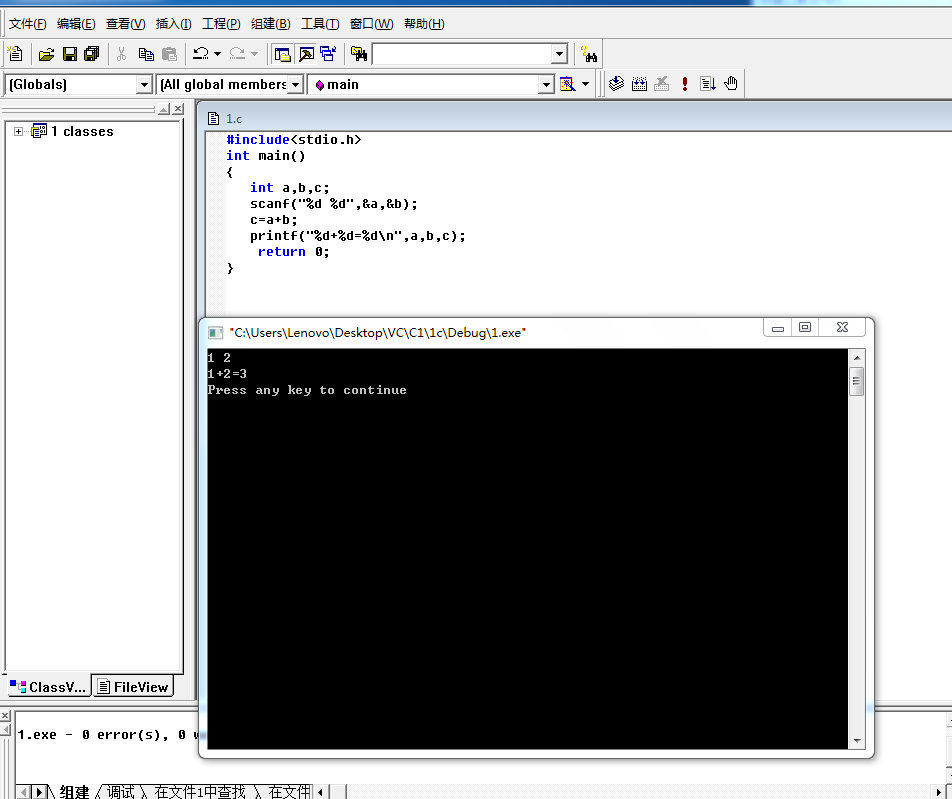
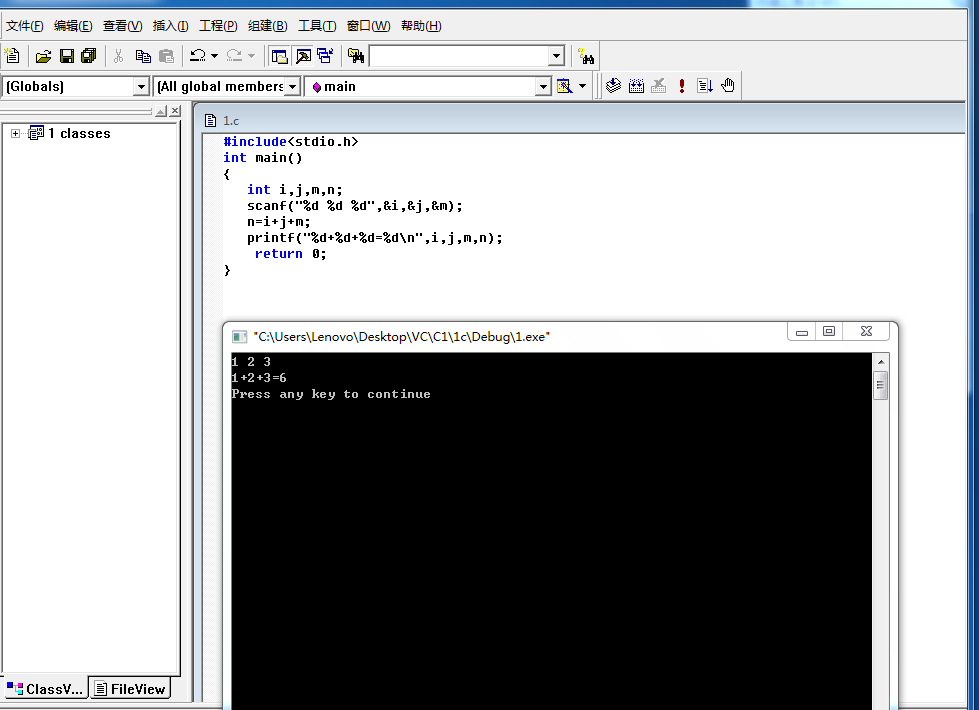
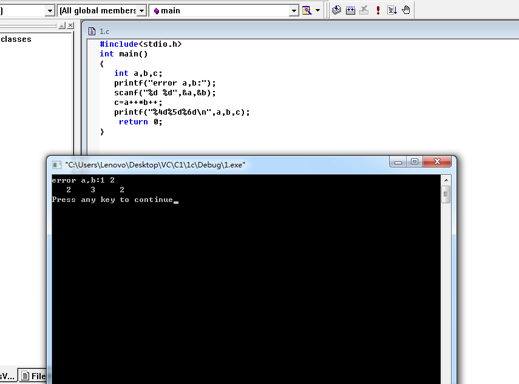

# 202303360胡锦辉

三、实验内容

## 1．输入下列程序，练习VC++6.0下程序的编辑、编译及运行，并对每一步的结果进行截图并分析结果。


### 1.正确输入上例程序并完成程序的编译及运行结果；


 输出了：

```c
Welcome to VC++6.0
```

### 2）不输入第一行语句#include <stdio.h>，重新编译程序；

 

编译并没有报错！

### 3）不输入return语句，重新编译程序；

 

 编译并没有报错！


### 4）去掉printf(“Welcome to VC++ 6.0．”);语句中的分号，重新编译程序，会有什么结果。

 

 程序编译显示报错！1error!

## 2．给出程序运行结果并上机验证

（要求上机前预先人工分析各程序并写出运行结果，然后上机进行结果验证）。


 

 

 结果如图：


 `am` 后并没有转行！因为没有`\n`转义字符。

## 3.完成下例程序的编辑、编译、运行并观察结果，说明该程序的功能。


运行结果:

 

 

### 功能：

1. 从键盘上获取两个数，并赋给a 和b两个变量 ；
2. 将a+b的值赋给c；
3. 最后输出 a+b=c的等式；

 

### 分析：

将`“scanf(“%d,%d”,&a,&b);”`改为`“scanf(“%d %d”,&a,&b);”`重新编译运行，输入数据的格式有何不同？

 

输入的格式发生了改变：

- 原来：用空格分隔开；
- 现在：用逗号分隔开；

## 4． 输入运行下面程序：


### 1）运行以上程序，写出结果并分析为什么会输出这些信息。

 

 结果：

```c
a b
97 98
```

- %c用于输出单个字符；
- %d用于输出十进制整数；


- 这里%d输出了整数；
- 这里%c输出了ASCII值对应的字符；

### 2）如果将程序第3行改为 char c1,c2;运行时会输出什么信息？

 

结果：

```c
a b
97 98
```

- 这里%c输出了字符；
- 这里%d输出了字符对应的ASCII值；

### 3）如果将程序第4行改为c1=397；c2=398;运行时会输出什么信息？为什么？

 

 

 

```c
？？
387 398
```

 397 超出了ASCII表的范围，输出了乱码？？

## 5、输入以下程序


### 1）编译和运行程序，写出程序的运行结果，注意i,j,m,n各变量的值。

 

 结果：

```c
9 11 9 10
```


### 2）将第6，7行改为m =i++;n=++j;,再编译运行，分析结果。

 

 结果：

```c
9 11 8 11
```

i 和 j 最终结果分别为 9 11

- 这时候m=i++,先m=i赋值，再i=i+1；
- 这时候n=++j,先j=j+1赋值，再n=j；

### 5． 参考上例程序，试编程完成三个整数的加法（从键盘输入三个整数）。

 

 

## 6． 给出程序运行结果并上机验证

（要求上机前预先人工分析各程序并写出运行结果，然后上机进行结果验证）。


运行结果：

 

结果：

```c
d
```

### 1）将语句c1=‘a’改写成c1=97并重新分析程序结果；

 

结果：

```c
d
```


### 2）将语句c1=‘a’改写成c1=“a” 并重新分析程序结果；


c1是char 单字符，"a"是字符串类型会出错；

### 3）将语句printf(“%c\n”,c1)改写成printf(“%d\n”,c1) 并重新分析程序结果；

 

结果：

```c
100
```

%d输出十进制整数，在这里输出char c1的ASCII值；

## 7． 给出程序运行结果并上机验证

（要求上机前预先人工分析各程序并写出运行结果，

然后上机进行结果验证）。


运行结果：

 

 结果：

```c
eror a,b=1 2
2 3 6
```


### 1）将语句c=++a*++b改写成c=a++*b++并重新分析程序结果；

 

这里 先c=a*b ,再a=a+1,b=b+1;

 

### 2）将语句printf(“%d %d %d\n”,a,b,c)改写成printf(“%4d%5d%6d\n”,a,b,c) 并重新分析程序结果。

 

>  %4d%5d%6d 规定了字宽

```c
   2  //字宽4
    3 //字宽5
     2//字宽6
```


## 8． 给出程序运行结果并上机验证

（要求上机前预先人工分析各程序并写出运行结果，

然后上机进行结果验证）。


运行结果：

 

 结果：

```
2.50000003.00000019.500000
```


### 1）如果没有语句c=a*b程序结果将会如何变化；

 

c结果变为7.500000 第二和第三括号内的数不起作用；

 

### 2）将程序中第二、三个花括号去掉并重新分析程序结果；

 

同（1

 

### 3）将语句printf(“%f%f%f\n”,a,b,c)改写成printf(“%6.3f%6.2f%6.1f\n”,a,b,c) 并重新分析程序结果。

 

 规定了字宽：

a字宽为6小数占三位；

b字宽为6小数占两位；

c字宽为6小数占一位；

## 9． 程序填空，完成2个变量值的交换。 

（根据给出程序的设计要求在划线部分填入正确的程序代码然后上机进行程序的验证）。

注意：部分源程序给出如下。请勿改动程序的任何内容，仅在程序中横线上填入所编写的若干表达式或语句。


答案：

```c
c=a;
a=b;
b=c;
```

 

 

 

## 10.程序填空，键盘输入任意一个3位整数，分别输出该数的百、十及个位数字。

（根据给出程序的设计要求在划线部分填入正确的程序代码然后上机进行程序的验证）。

注意：部分源程序给出如下。请勿改动程序的任何内容，仅在程序中横线上填入所编写的若干表达式或语句。

 


答案： 

```c
b=a%10;
c=(a/10)%10;
d=(a/100)%10
```

 

 

## 11.用下面的scanf函数输入数据，使a=32,b=71,x=8.52,y=701.82,c1=’B’,c2=’b’,在键盘上应如何输入？


答案：

```
a=32 b=71 8.52 701.82 B b
```

 

 


