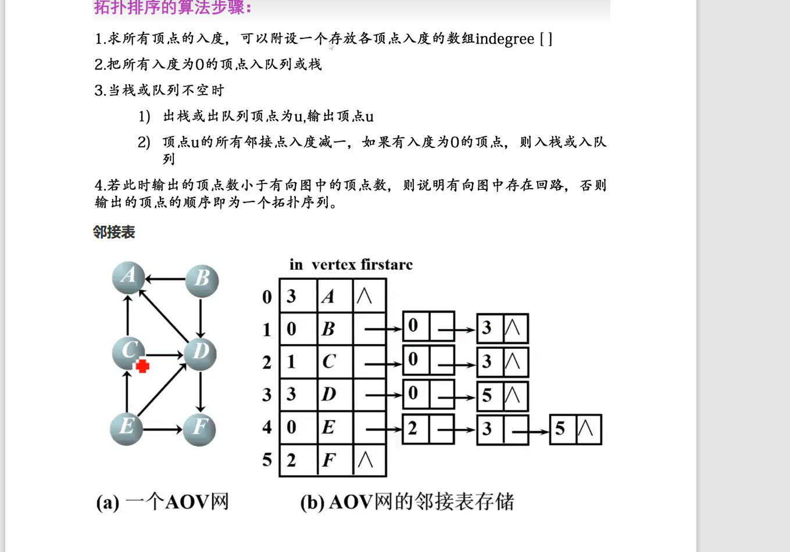

## 2024-3-2

### 邻接表

- 结构：序号 名称 后续元素链
- 后续元素链结构：序号  地址

```c
typedef struct aList{//链
  int num;//数组位置
  struct aList*next;//下一链接地址
}*L;//指针名称

typedef struct AOVList{
    int num;//序号
    char name[25];//项目名称
    L *next;//链
}AL,*ALP;

```


### 拓扑排序：

