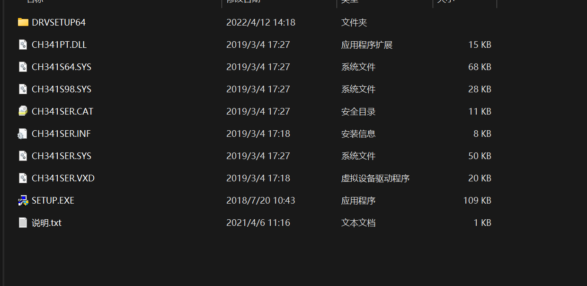
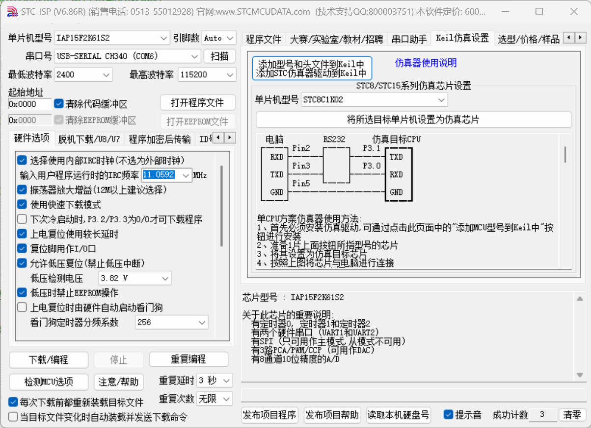
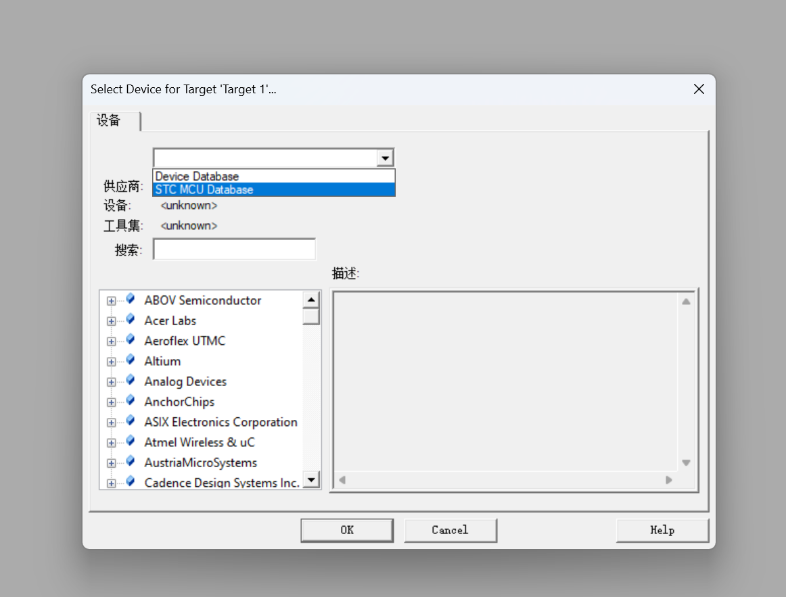
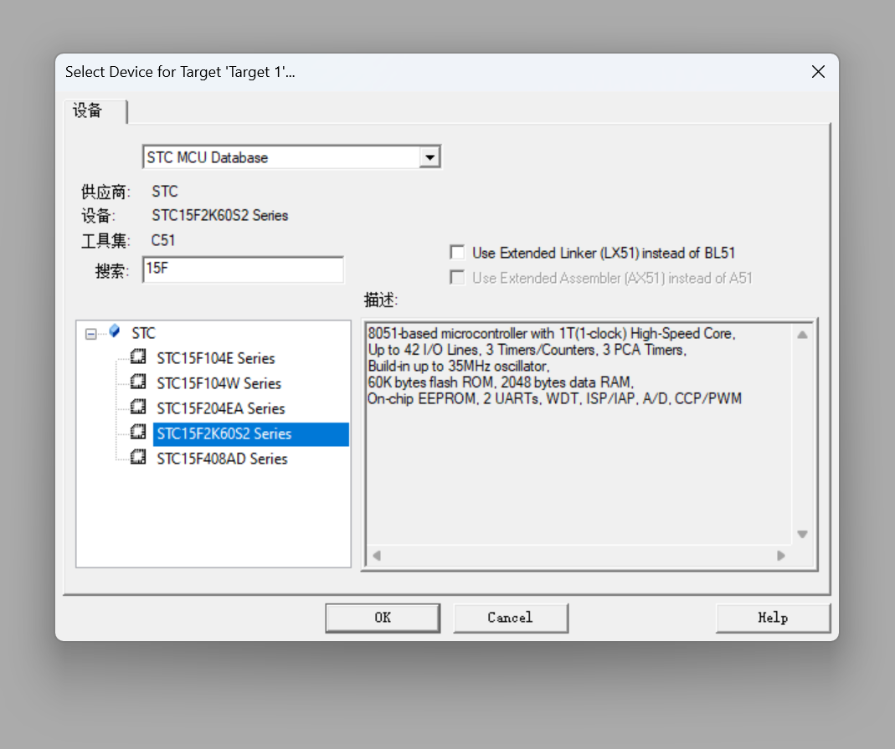
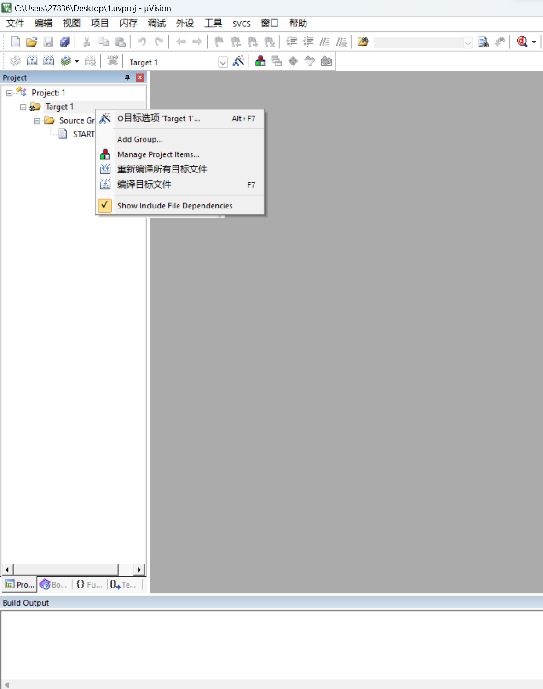
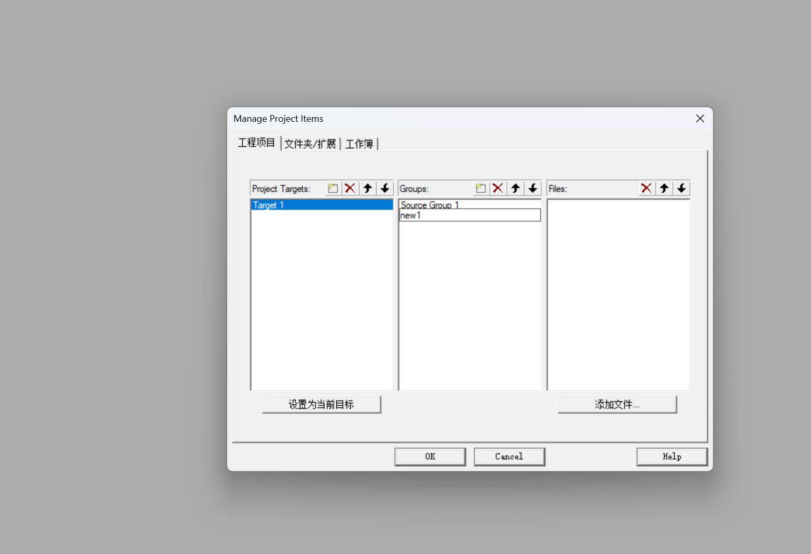
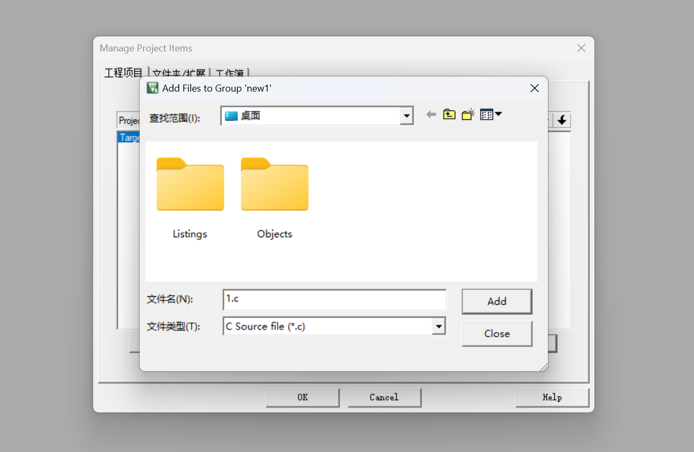
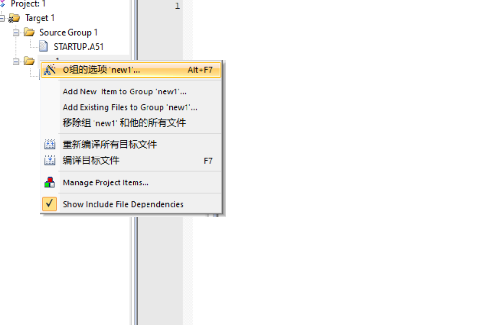
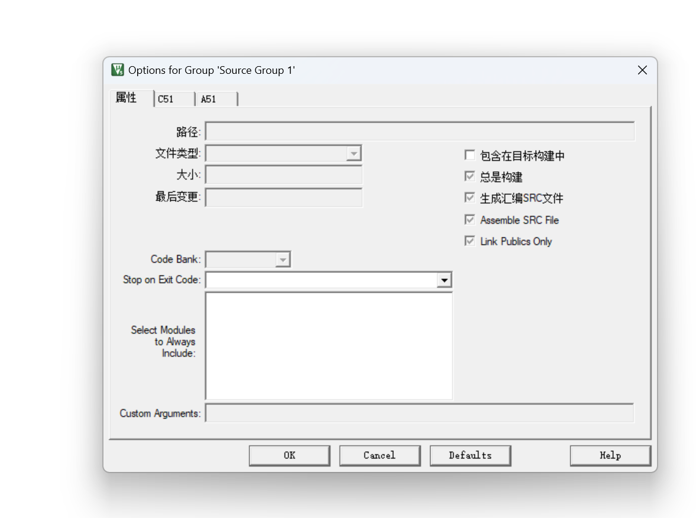

### keil文件配置：

#### STC iSP文件配置：

1. **1添加头文件到KEil目录下；**

> 目录下一定包含U4 C51
>
> 单片机型号图
>
> 串口需要下载setup.exe
>
> 

2. **hex文件烧入**:

- 打开程序文件；
- 选中hex文件烧入；
- 下载/编程；
- 点击单片机重启按键

#### keil文件创建：

1. **打开new project**
2. **进行如图选择；**

3. **选择单片机型号；**

#### 多文件编译：

1. **选择Manage Project;**

2. **选择新的插入；**

3. **选择添加文件**；C源文件在外部创建；

4. **禁止其他文件**；

> **取消包含**