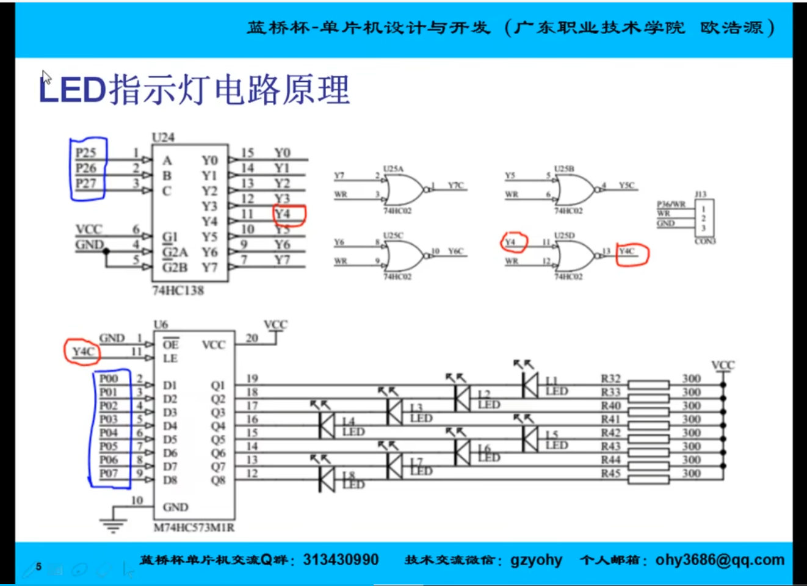
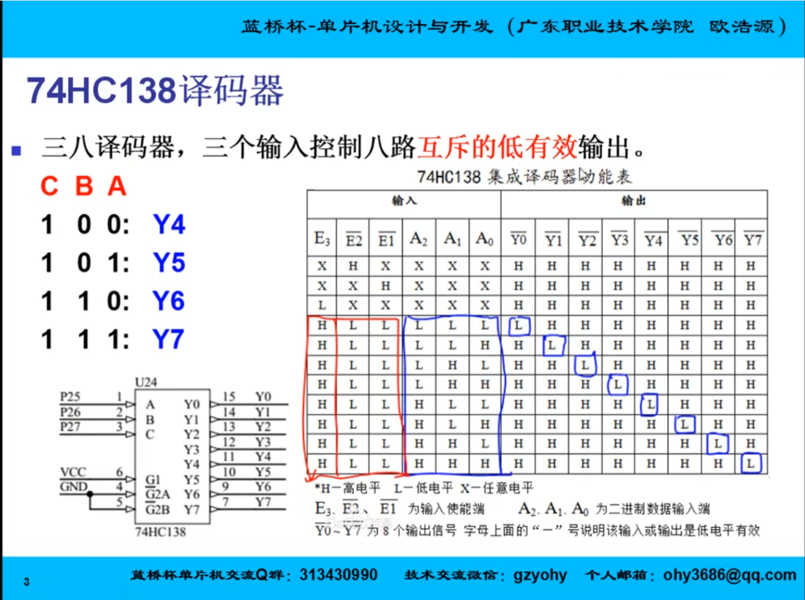
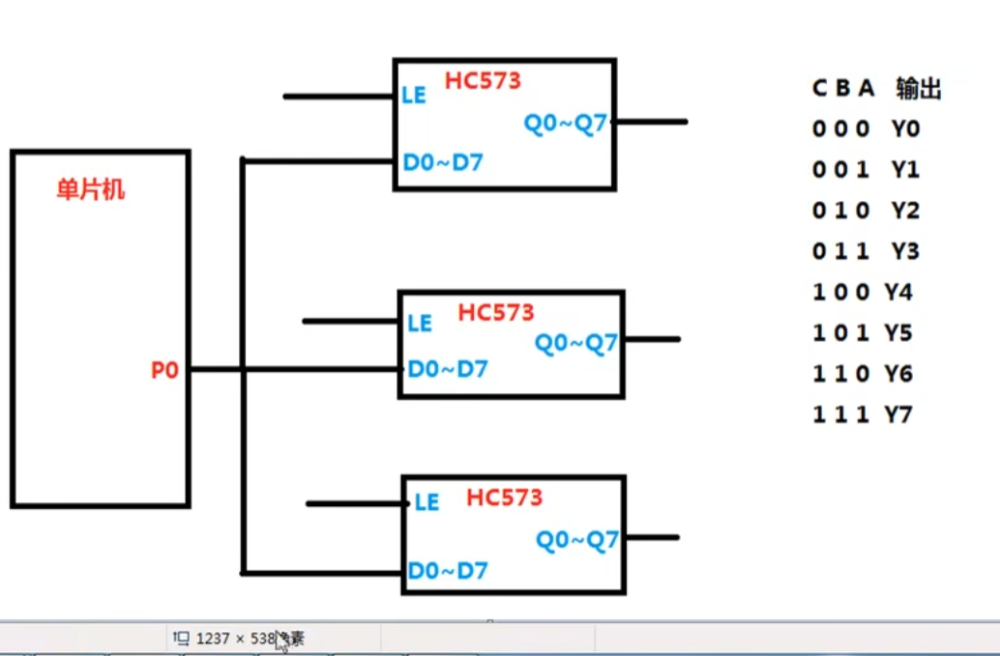
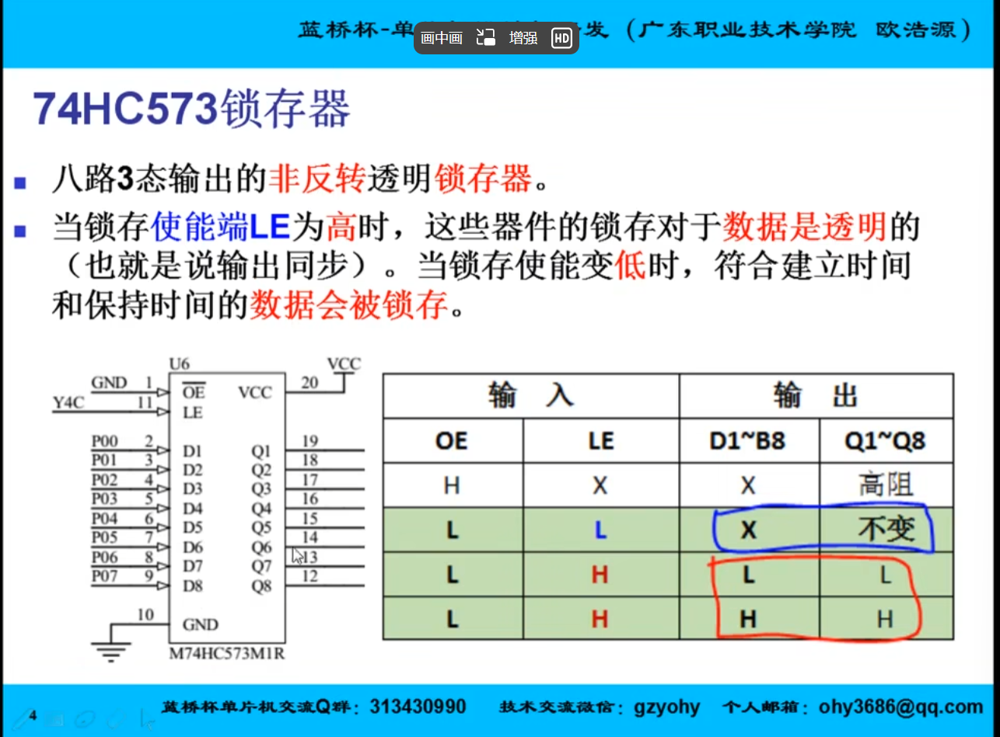

## Led基本控制：




> J13 IO扩展模式

### HC138译码器：

- **C~A2**
- **B~A1**
- **A~A0**



三路控制八路

#### 输出：（二进制）



### HC573锁存器：



### led指示灯原理：


- **138译码器 Y4口输出控制；‘**
- **HC02 取反控制，WR始终为0，Y4输出1,Y4C输出0；**

### 代码：

#### 蜂鸣器开关：

```c
void InitSys()
{
	HC138_C = 1;	//选中138的Y5，用以控制继电器和蜂鸣器
	HC138_B = 0;
	HC138_A = 1;
	P0=0x00;			//关闭继电器和蜂鸣器
}
```


#### 138译码器引脚：

```c
#include "reg52.h"

sbit HC138_A = P2^5;//控制A0
sbit HC138_B = P2^6;//控制A1
sbit HC138_C = P2^7;//控制A2

```

> sbit 单位 一位 只有0和1


#### 点亮：

```c
HC138_C = 1;	//选中138的Y4，用以控制8个LED灯
HC138_B = 0;
HC138_A = 0;
P0=0x00;//采用灌电流
```


#### 延时函数：

```c
void Delay(unsigned int t)
{
	while(t--);		//重复多次以得到较大的延时
	while(t--);
	while(t--);
	while(t--);	
	while(t--);
	while(t--);
	while(t--);
	while(t--);
}
```

