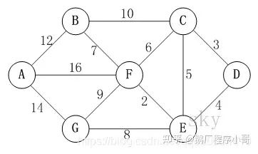
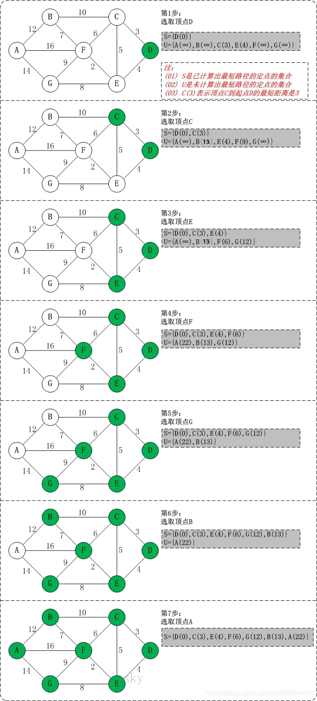

## AOV网--拓扑排序：

### AOV网：

AOV代码：

```c
//Hash数据结构
typedef struct aList{//链
    int num;//数组位置
    struct aList*next;//下一链接地址
}*L;//指针名称

typedef struct AOVList{
    int num;//可入度
    char name[5];//项目名称
    int pass;//是否遍历--------------------------------------------------------
    int weight;//时间----------------------------------------------------------------------------------------------------
    L next;//链
}AL,*ALP;
```


- 左侧为邻接数组`struct AOVList`
- 右侧为相邻的链`struct aList`


### 拓扑排序：

**广度优先BFS**

在图论中，拓扑排序（Topological Sorting）是一个有向无环图（DAG, Directed Acyclic Graph）的所有顶点的线性序列。且该序列必须满足下面两个条件：

- 每个顶点出现且只出现一次。

- 若存在一条从顶点 A 到顶点 B 的路径，那么在序列中顶点 A 出现在顶点 B 的前面。

有向无环图（DAG）才有拓扑排序，非DAG图没有拓扑排序一说。

例如，下面这个图：


它是一个 DAG 图，那么如何写出它的拓扑排序呢？这里说一种比较常用的方法：

1. 从 DAG 图中选择一个 没有前驱（即入度为0）的顶点并输出。

2. 从图中删除该顶点和所有以它为起点的有向边。
3. 重复 1 和 2 直到当前的 DAG 图为空或当前图中不存在无前驱的顶点为止。后一种情况说明有向图中必然存在环。


于是，得到拓扑排序后的结果是 { 1, 2, 4, 3, 5 }。

通常，一个有向无环图可以有一个或多个拓扑排序序列。

*如果输出的顶点少于实际的顶点个位，必定有环*


#### 代码实现：

由栈实现：

1. 遍历邻接数组，找到可入度为0的入栈；
2. 弹出栈的元素，输出；
3. 遍历顶点的邻接链，可入度都-1，如果有可入度为0入栈；
4. 重复2，3直到清空栈；
5. 检测如果输出的少于实际顶点数，说明有环；


```c
bool Compare(AL p[],int i){//排序数组 
    //-----------------排序-----------------
    ALP ap0;//单个表单的地址
    int put_l=0;//输出长度
    
    list ps=(list) malloc(sizeof (Stack));//建栈
    ps->pointer=-1;//初始化栈指针
    
    for (int j = 0; j < i; ++j) {
        if(p[j].num==0) push(ps,&p[j]);//入栈
    }
    
    ap0= pop(ps);
    while (ap0!=NULL) {
        printf("%s\t",ap0->name);
        is[ap0->name[0]]= false;//节点已经输出---------------
        put_l++;
        
        for (L j = ap0->next; j != NULL; j = j->next) {
            p[j->num].num--;//可入度-1
            if (p[j->num].num == 0) push(ps, &p[j->num]);//可入度为0 入栈
        }
        ap0= pop(ps);
    }
    
    //--------------闭环处理---------------------
    if(put_l<i){
        printf("有闭环\n");
        return false;
    } else return true;
    //-----------------------------------------
}
```


### 搜索打印环：

*如果输出的顶点少于实际的顶点个位，必定有环*

递归实现：

- 访问当前节点，
- 检测每个节点后是否有环，如果有打印输出当前节点（排除已经拓扑排序输出的；
- 递归访问未访问的节点，如果遇到正在访问的节点说明有环；
- 递归后访问结束；


```c
ALP Circle(int num,AL p[]){
    L ql;
    p[num].pass=1;//正在访问
    if(p[num].next==NULL) {
        p[num].pass=-1;//结束访问
        return NULL;
    }
    ql=p[num].next;
    do{
        if(p[ql->num].pass==1) return &p[ql->num];//环
        if(p[ql->num].pass==0 && Circle(ql->num,p)!=NULL) return &p[ql->num];//环

        ql=ql->next;
    }while(ql!=NULL);
    p[num].pass=-1;//结束访问
    return NULL;

}
```


### **最短路径算法-迪杰斯特拉(Dijkstra)算法**

迪杰斯特拉(Dijkstra)算法是典型最短路径算法，用于计算一个节点到其他节点的最短路径。
它的主要特点是以起始点为中心向外层层扩展(广度优先遍历思想)，直到扩展到终点为止。


**基本思想**

1. 通过Dijkstra计算图G中的最短路径时，需要指定一个起点D(即从顶点D开始计算)。
2. 此外，引进两个数组S和U。S的作用是记录已求出最短路径的顶点(以及相应的最短路径长度)，而U则是记录还未求出最短路径的顶点(以及该顶点到起点D的距离)。
3. 初始时，数组S中只有起点D；数组U中是除起点D之外的顶点，并且数组U中记录各顶点到起点D的距离。如果顶点与起点D不相邻，距离为无穷大。
4. 然后，从数组U中找出路径最短的顶点K，并将其加入到数组S中；同时，从数组U中移除顶点K。接着，更新数组U中的各顶点到起点D的距离。
5. 重复第4步操作，直到遍历完所有顶点。

#### **迪杰斯特拉(Dijkstra)算法图解**





以上图为例，来对迪杰斯特拉进行算法演示(以顶点D为起点)。




**初始状态**：S是已计算出最短路径的顶点集合，U是未计算除最短路径的顶点的集合！
**第1步**：将顶点D加入到S中。
此时，S={D(0)}, U={A(∞),B(∞),C(3),E(4),F(∞),G(∞)}。 注:C(3)表示C到起点D的距离是3。

**第2步**：将顶点C加入到S中。
上一步操作之后，U中顶点C到起点D的距离最短；因此，将C加入到S中，同时更新U中顶点的距离。以顶点F为例，之前F到D的距离为∞；但是将C加入到S之后，F到D的距离为9=(F,C)+(C,D)。
此时，S={D(0),C(3)}, U={A(∞),B(13),E(4),F(9),G(∞)}。

**第3步**：将顶点E加入到S中。
上一步操作之后，U中顶点E到起点D的距离最短；因此，将E加入到S中，同时更新U中顶点的距离。还是以顶点F为例，之前F到D的距离为9；但是将E加入到S之后，F到D的距离为6=(F,E)+(E,D)。
此时，S={D(0),C(3),E(4)}, U={A(∞),B(13),F(6),G(12)}。

**第4步**：将顶点F加入到S中。
此时，S={D(0),C(3),E(4),F(6)}, U={A(22),B(13),G(12)}。

**第5步**：将顶点G加入到S中。
此时，S={D(0),C(3),E(4),F(6),G(12)}, U={A(22),B(13)}。

**第6步**：将顶点B加入到S中。
此时，S={D(0),C(3),E(4),F(6),G(12),B(13)}, U={A(22)}。

**第7步**：将顶点A加入到S中。
此时，S={D(0),C(3),E(4),F(6),G(12),B(13),A(22)}。

此时，起点D到各个顶点的最短距离就计算出来了：**A(22) B(13) C(3) D(0) E(4) F(6) G(1**

#### 程序实现：

```c
void dijkstra(AL p[],int pre[],int dtc[],int source,int i){
    bool visited[i];//是否访问
    for (int j = 0; j < i; ++j) {//初始化
        visited[j]=false;
        pre[j]=-1;
        dtc[j]=INT_MAX;//无穷大
    }
    dtc[source]=0;//A到本身距离为0
    int n;//到原点距离最小数组序号
    for (int j = 0; j < i-1; ++j) {//遍历i-1次
        int min=INT_MAX;
        for (int k = 0; k < i; ++k) {//遍历dtc找到路径最短
            if(!visited[k]&&dtc[k]<min){
                min=dtc[k];
                n=k;
            }
        }
        visited[n]=true;//节点找到

        // 更新当前最短路径和前驱顶点
        // 即，更新"未获取最短路径的顶点的最短路径和前驱顶点"。

        L ql=p[n].next;//相邻节点链接
        while(ql){
            if(!visited[ql->num]&&p[n].weight+dtc[n]<dtc[ql->num]&&dtc[n]!=INT_MAX){
                dtc[ql->num]=p[n].weight+dtc[n];//更新相邻节点路长
                pre[ql->num]=n;//ql->num的前驱节点为n
            }
            ql=ql->next;
        }
    }
}

```

