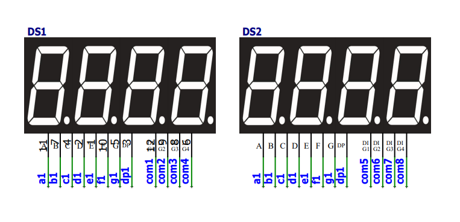
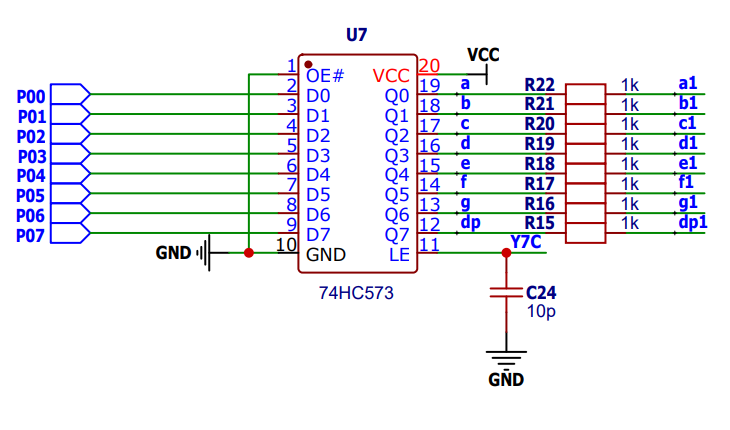
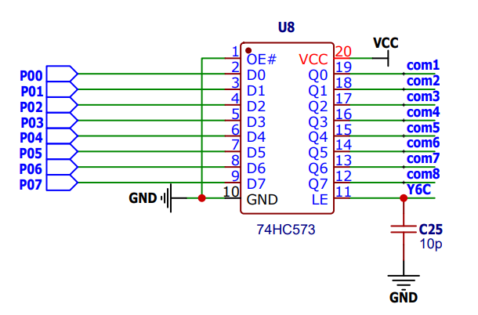
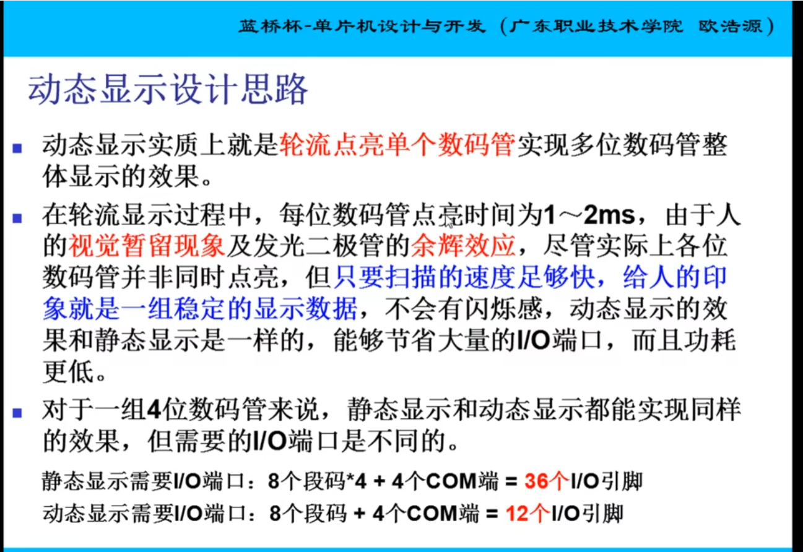

# 共阳极数码管

## 四位共阳极数码管

### 引脚图

### 官方图

## HC573-引脚图--YC7

主要采用灌电流 ；外部供电；

- 内部输出高电平 灯熄灭；
- 内部输出低电平 灯亮起；

## HC573-共阳极--YC6

- 共阳角com1-8对应了数码管从左到右；
- 共阳极为供电级，输出高电平供电，

### 控制：使用`unsigned char`

**char** vs **unsigned char**
相同点：在内存中都是一个字节，8位（2^8=256），都能表示256个数字
不同点：char的最高位为符号位，因此char能表示的数据范围是-128~127，unsigned char没有符号位，因此能表示的数据范围是0~255

## 动态显示：

