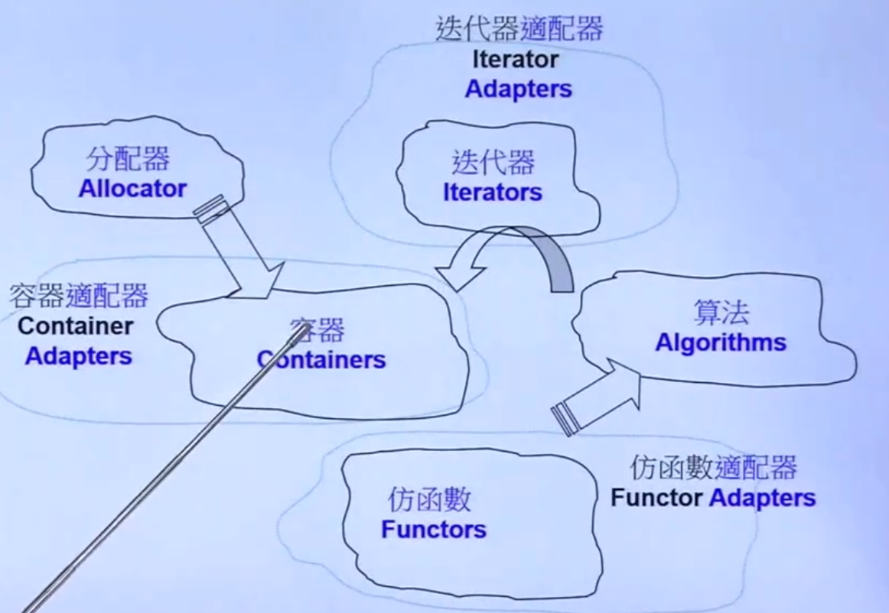
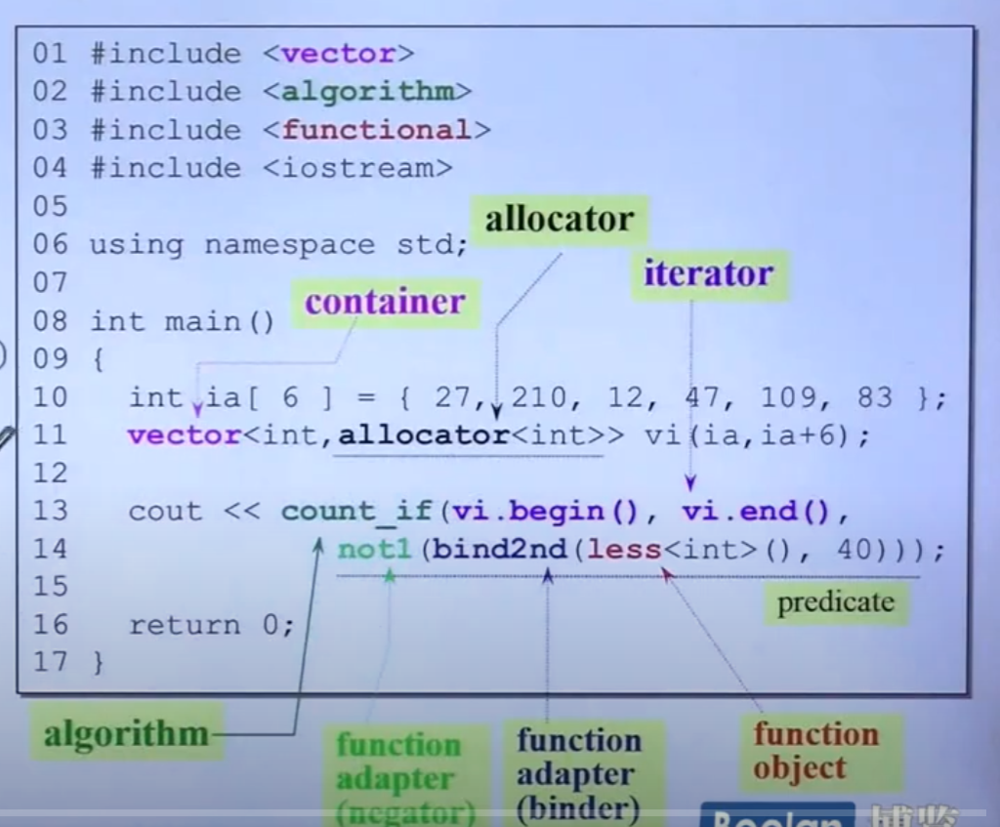
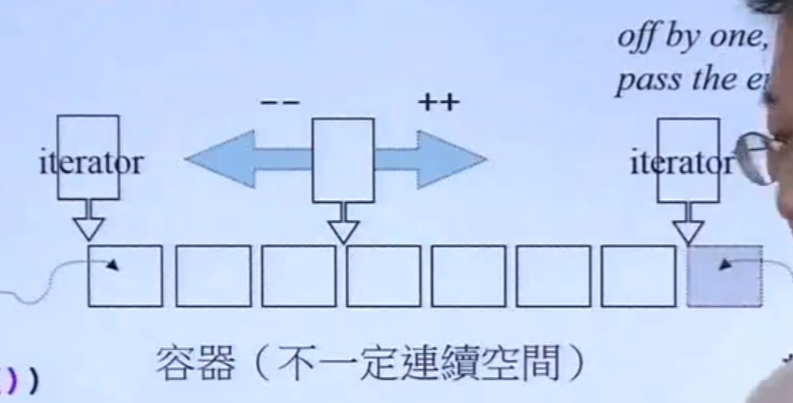
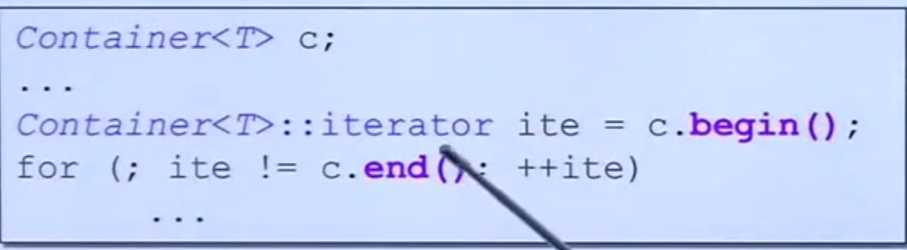
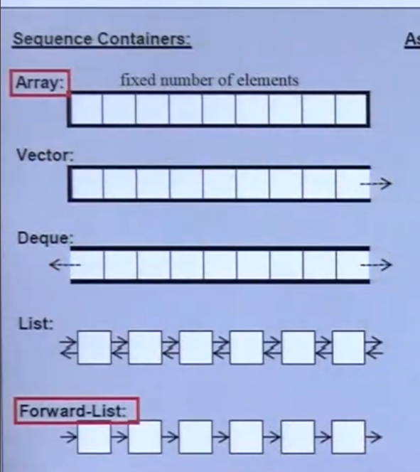
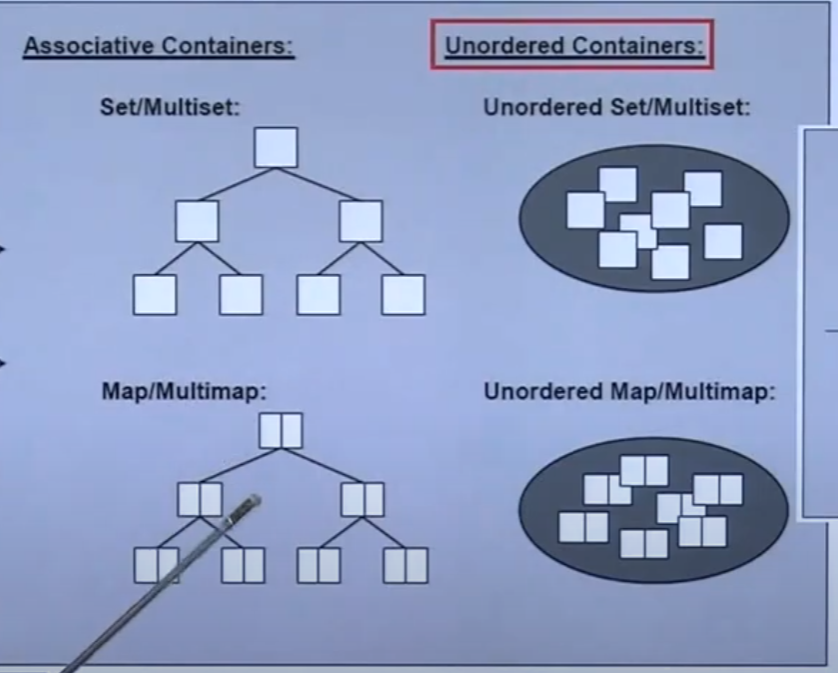

# C++ STL

## STL 头文件：

### 新式:`<cstdio>`不包含.h

### 封装：using namespace std;

## 网站：

### cplusplus.com

### CppReference.com

### gcc.gnu.org

## STL：组成






- allocator分配器，指定分配数值类型；

- count_if算法
- begin,end迭代器；
- less仿函数；
- bind2nd adapter转换器；

### Big_oh:复杂度

### iterateor:[前闭，后开)

begin()指向第一个元素；

end()指向最后一个的下一个元素；



#### 遍历：




### 新for:

```c++
for(int x:arry){
	cout<<x<<endl;
}
```

### auto关键字：

```c++
auto iter=find(c.begin(),c.end(),target)
```

从右到左推到变量类型；

## STL使用：

### 时间检查：

头文件`<ctime>`

当前时间 clock()

### 容器：

- #### Sequence：顺序

- #### Associative:关联

- Unorder:无序





- Mult非重复

Hash:


#### Array:

##### 定义：array<type,size> c;

##### 函数：

- size()大小
- front()第一个
- back（）最后一个；
- data()地址值

