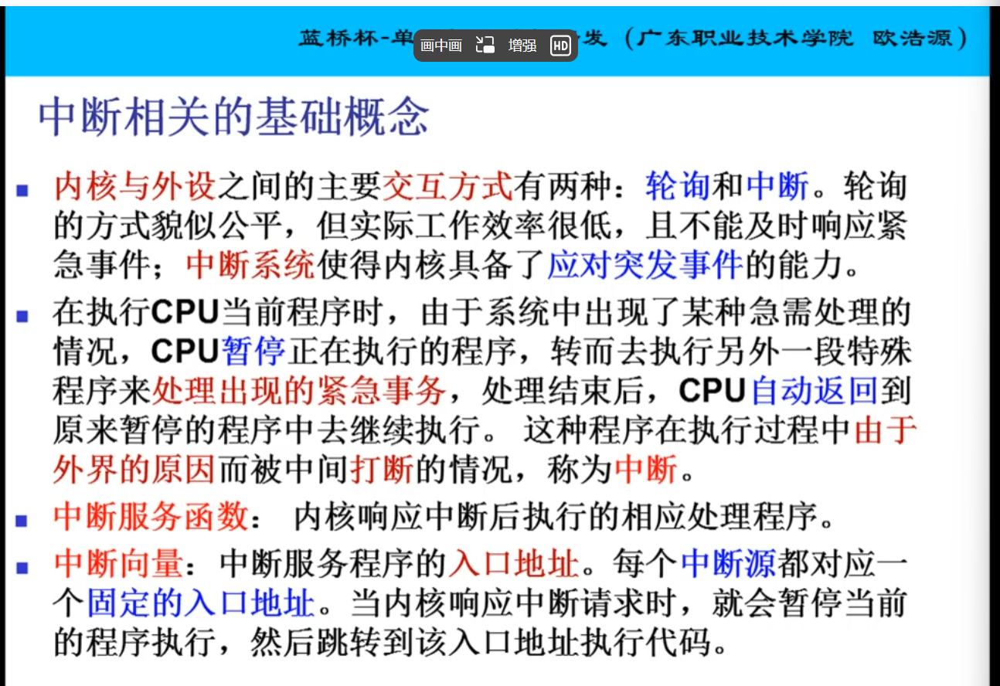
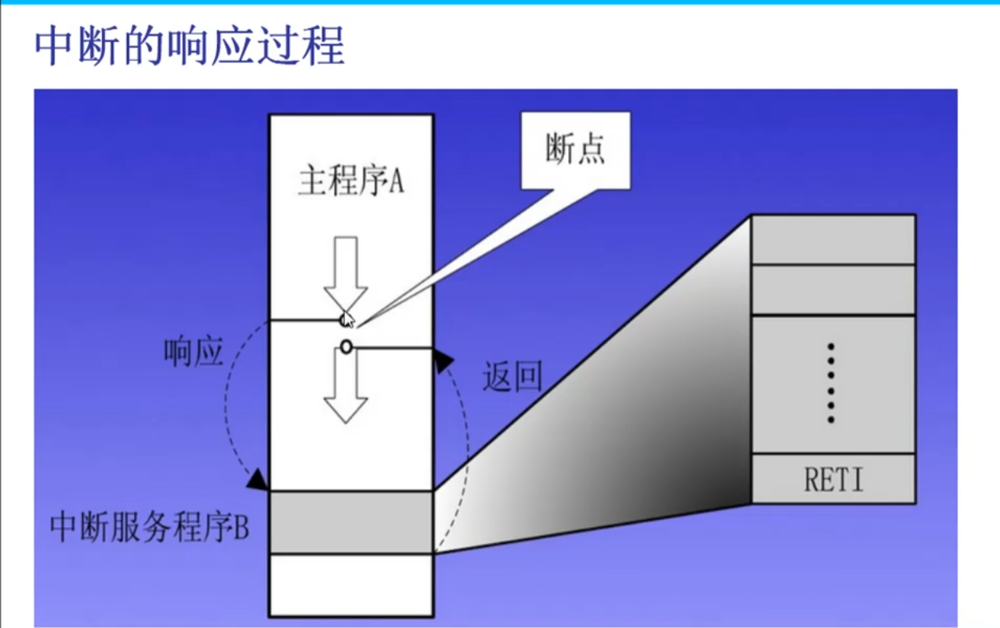
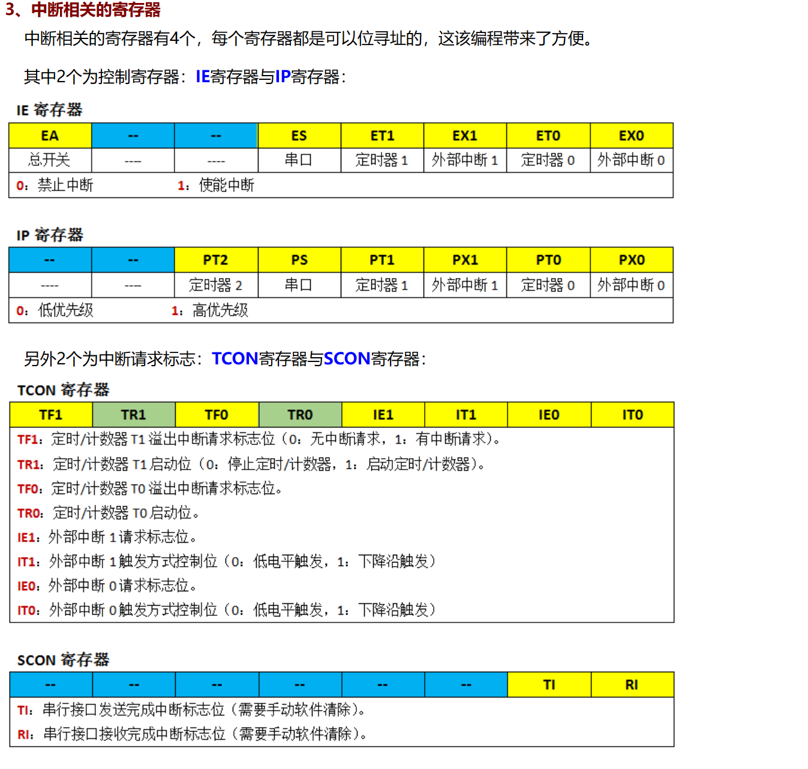
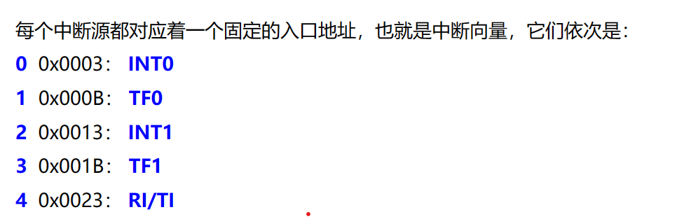

# 中断

## 概念





## 中断响应过程



### 中断优先级：

- 外部中断0；INT0
- 定时中断0；T0
- 外部中断1；INT1
- 定时中断1；T1

### 内部结构：


> 需要将对应IE中断器开关 和 总开关EA合上；



## 中断函数编写

  一般情况下，中断的处理函数有两个，其一为中断初始化函数，其二为中断服务函数。初始化函数就是一个普通的函数，而中断服务函数却有特殊的格式要求：
  <1> 中断函数没有返回值，也不能带参数。
  <2> 函数名后面要跟一个关键字interrupt，说明这是一个中断服务函数。
  <3> 在关键字interrupt后面要跟上中断号，说明这个中断服务函数是为那个中断服务的。

### **中断服务函数的格式为：**

中断产生后，跳转到中断服务函数；

```c
void 函数名()  interrupt **中断号**
{

​      ----函数体----

}
```

### 中断服务号：



  我们要利用定时器0来进行间隔定时，中断程序架构我们C语言可以这样写：

