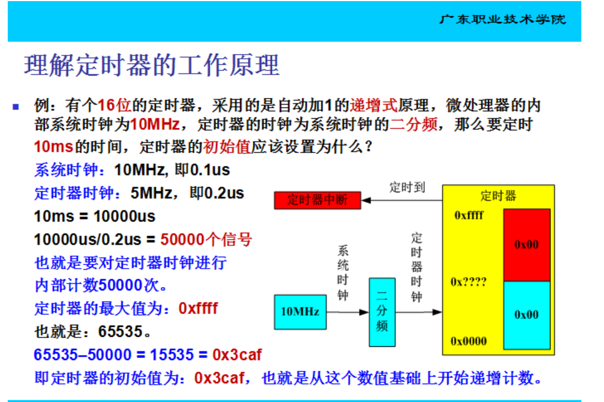
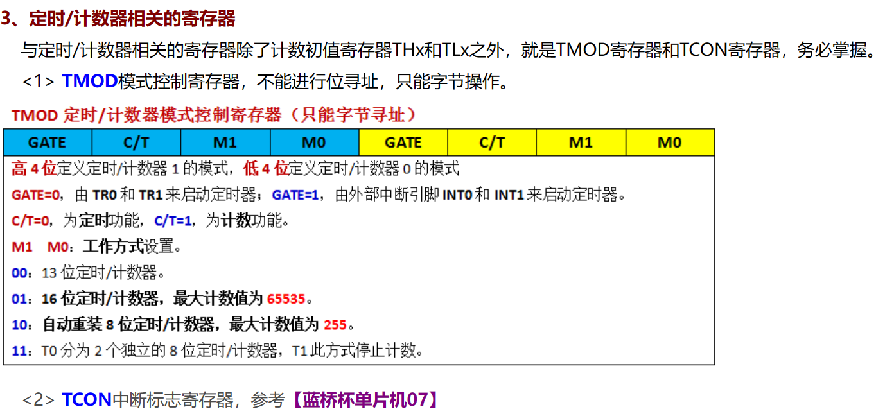
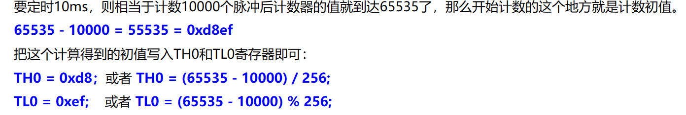

# 定时器

## 定时器定义



定时器为16位：

- T0计时器：高八位TH0,低八位TL0;
- T1计时器：高八位TH1,低八位TL1;


## 计时器的使用

### TMOD:



> TMOD选择计时器


### TH TL计时长度



TH为高八位，（1111 1111 1111 1111）2=（65535）10 ，/256得到对应数值；

TL则取余数

> （256）10=（1 0000 0000）2


### TR设定开始计时：

`TR1=1;`//第二计时器

`TR0=1;`//第一计时器


## EG:

```c
void InitTimer3(){
	TMOD= 0x10;
	TH1=(65535-50000)/256;//10ms
	TL1=(65535-50000)%256;
	ET1=1;
	EA=1;
	TR1=1;
}

```

