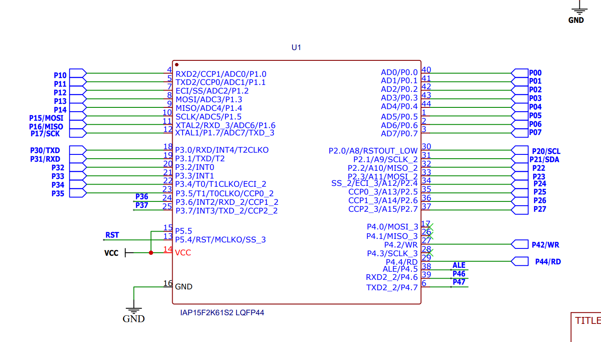
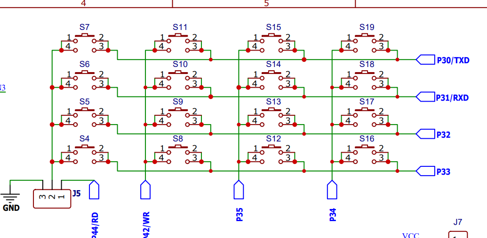
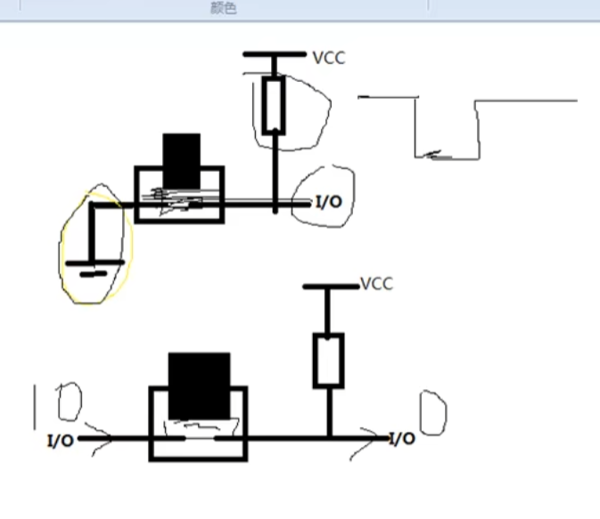

# 独立按键




## 端口

>  和矩阵键盘类似：P30,P31,P32,P33






- P30,P31,P32,P33原始状态为高电平；
- P30,P31,P32,P33按下按键后接地为低电平；


```c
sbit S7=P3^0;
sbit S6=P3^1;
sbit S5=P3^2;
sbit S4=P3^3;
```


### 检测代码：


非循环：方便定时

特点：按下按键代码生效

```c
if(!S7){
	delay(10);//消抖
    if(!S7){需要执行的代码。。。}
}
```


循环：松开按键生效

```c
if(!S7){
    while(!S7){循环代码。。。}
}

松开按键生效代码。。。
```

