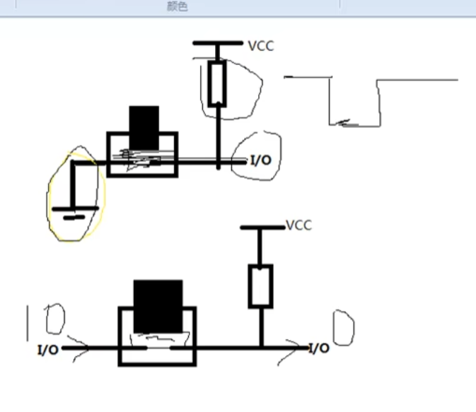

# 矩阵键盘

## HC138 P2高三位

P2端口图：


```c
void init74hc138(unsigned char cha)
{
         switch(cha)
        {
          case 4: P2 = (P2 & 0x1f) | 0x80 ;break;   //开led 的锁存器
          case 5: P2 = (P2 & 0x1f) | 0xA0 ;break;   //开蜂鸣器和继电器的锁器
          case 6: P2 = (P2 & 0x1f) | 0xC0 ;break;   //数码管段选
          case 7: P2 = (P2 & 0x1f) | 0xE0 ;break;   //数码管位选
          default:break;
        }
}
```

## 矩阵键盘

### 端口：


- P3端口中**P30 P31 P32 P33**控制了R横行；
- 剩下**P34 P35 和 P42 P44**控制了列；


> 注意：P4端口需要定义：`sfr P4=0xc0;`


### 检查：

内部结构：



 对与矩阵键盘，我们只能逐行扫描，然后读取列的状态信号。**如果R3行输出低电平，那么黄色按键如果有按下动作的话，那读取C2列信号也应该为低电平**，而该行上其他没有按下动作的按键的列信号则为高电平。因此，我们可以得到矩阵键盘的基本扫描步骤：

-   <1> R1输出低电平，R2、R3、R4输出高电平，逐个读取判断列信号，如果都为高电平则R1行上没有按键按下。
-   <2> R2输出低电平，R1、R3、R4输出高电平，逐个读取判断列信号。
-   <3> R3输出低电平，R1、R2、R4输出高电平，发现C2列信号为低电平，那么可以判断得R3行的C2列的按键有按下动作。
-   <4> R4输出低电平，R1、R3、R4输出高电平，逐个读取判断列信号。
    如此循环往复，扫描的按键的状态。

#### R行检测代码：

```c
void switch_R(unsigned char R){//R赋值,扫描
	switch (R){
		case 1:
			P3=(P3&0xf0)| 0x0e; //使用后低4位 1110
			break;
		case 2:
			P3=(P3&0xf0)| 0x0d;//1101
			break;
		case 3:
			P3=(P3&0xf0)| 0x0b;//1011
			break;
		case 4:
			P3=(P3&0xf0)| 0x07;//0111
			break;
	}
}
```

#### 原理：

P30 P31 P32 P33为P3端口低四位：

- 由`P3=(P3&0xf0)`控制低四位为0；
- 再进行**或运算**使对应端口为0低电平；
- 逐行扫描检测；


### C行检测代码：

```c
sbit C1=P4^4;
sbit C2=P4^2;
sbit C3=P3^5;
sbit C4=P3^4;
void chack_C(){
	C1=C2=C3=C4=1;
}
```

> C行始终为1；如果对应R行为0低电平，则C=0低电平


### 按键位置确定的代码：


```c
	for(i=0;i<4;i++){
		switch_RC(i);
		if(C1==0&&R1==0){num=1;}
		else if(C2==0&&R1==0){num=2;}
		else if(C3==0&&R1==0){num=3;}
		else if(C4==0&&R1==0){num=4;}
		else if(C1==0&&R2==0){num=5;}
		else if(C2==0&&R2==0){num=6;}
		else if(C3==0&&R2==0){num=7;}
		else if(C4==0&&R2==0){num=8;}
		else if(C1==0&&R3==0){num=9;}
		else if(C2==0&&R3==0){num=10;}
		else if(C3==0&&R3==0){num=11;}
		else if(C4==0&&R3==0){num=12;}
		else if(C1==0&&R4==0){num=13;}
		else if(C2==0&&R4==0){num=14;}
		else if(C3==0&&R4==0){num=15;}
		else if(C4==0&&R4==0){num=16;}
		}
```

