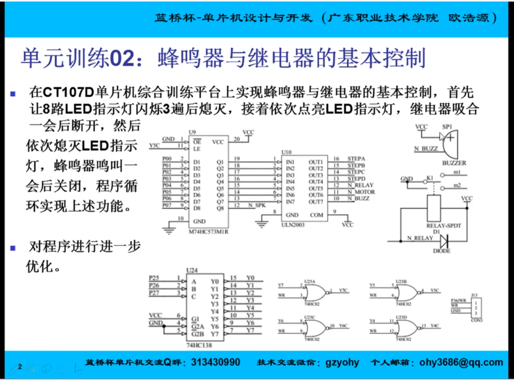
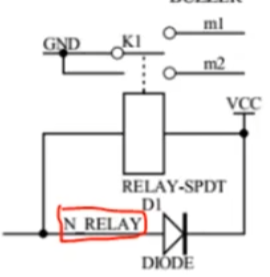
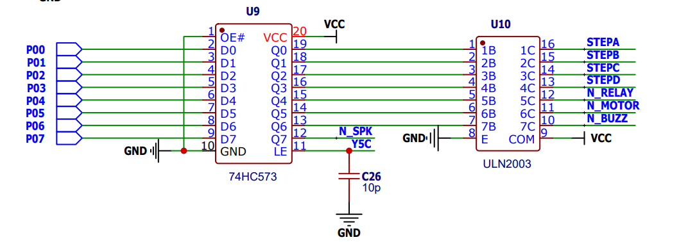
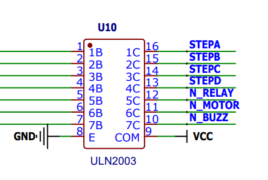
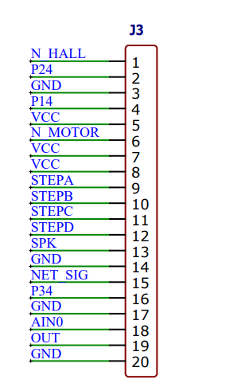
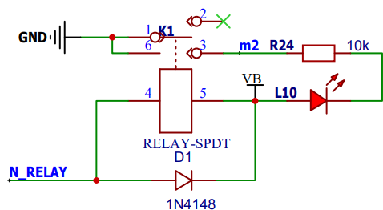
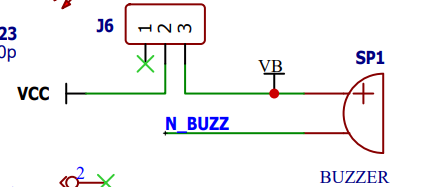

## 蜂鸣器&继电器：

**P0端口数据输入，0000 0000 低位控低数值端口**

### 继电器：

> 接低电平-吸合接m2

### 蜂鸣器HC573:

- P0端口输入信号；
- N_SPK外放 转接LM386D;
- Q1~Q8外接达林顿管（取反输出）；

### ULN2003:

> IN 非门：in输入1，out输出0；

#### STEPA,STEPB,STEPC,STEPD，N_motor外接，J3；

#### N_RELAY继电器;

> K1接3，回路闭合；
>
> 上电后 L10亮起；
>
> VB =VCC 变成电源

### 蜂鸣器：

> 给低电平-工作