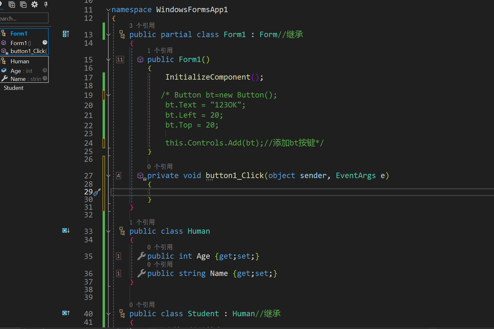

# C#

## 语法

### 变量：


### 存储单位


### 计算


### 格式化：$"abc={n}"


## winform

### 设计界面：

添加界面元素；


### designer.cs代码设计：


### 内部代码MainForm.cs：



### 


## 界面设计：

### 工具箱拖动设计


### 右键属性：


Text进行Form名称修改；

BacKColor进行背景颜色修改

FromBorderstyle禁止窗口缩放；

MinSizeBox,MaxSizeBox关闭防止缩放；


## 基本操作：

### 类的创建：

直接创建,直接选中类 或者 用户控件


#### 模板：

```c#
namespace Minesweeper：Button
{
    public class Pane
    {
        //属性
        public int Id { get; set; }

        //方法

        public void Def()
        { 
        }
    }
}
```

一个类只能继承于一个类（Button）

### 控件的创建与使用：

#### 创建：

- 直接从（.cs）设计中拖动添加到Form窗口；

```c#
            // 
            // menuStrip1
            // 
            this.menuStrip1.GripMargin = new System.Windows.Forms.Padding(2, 2, 0, 2);
            this.menuStrip1.ImageScalingSize = new System.Drawing.Size(24, 24);
            this.menuStrip1.Items.AddRange(new System.Windows.Forms.ToolStripItem[] {this.难度});
            this.menuStrip1.Location = new System.Drawing.Point(0, 0);
            this.menuStrip1.Name = "menuStrip1";
            this.menuStrip1.Size = new System.Drawing.Size(480, 32);
            this.menuStrip1.TabIndex = 3;
            this.menuStrip1.Text = "menuStrip1";
```

FormDesigner.cs中会自动添加代码，生成参数；

- 代码动态生成；

```c#

for (int i = 0; i < PaneLineNum*PaneLineNum; i++) { //添加100个雷到雷区
    Pane pane = new Pane();
    this.Controls.Add(pane);

}
```

创建一个新的对象Pane;

将其添加到对应窗口类的控件（Controls）中；


#### 使用：


##### 特殊控件;较少的单独的控件

> 建议:特殊控件取名，方便查找使用；

```c#
pane.Name = "地雷";
this.Controls.Add(pane);
```

```c#
Pane pane = (Pane)this.Controls["地雷"];
Pane pane = this.Controls["地雷"] as Pane;//与以上代码等价
```

##### 批量控件的遍历查找：

```
foreach (Pane pane in this.Controls)//遍历周围雷数
{
    pane.AroundNumber = this.GetAroundNumber(pane);

}
```

#### 控件的属性：

可直接根据属性面板 用 `对象.属性（）=`设置；


常用设置：

- .Size =new Size(width,height)
- .Location = new Point(Left,Top)

### 事件绑定：

#### 绑定：

Eg:

```c#
 pane.MouseDown += new MouseEventHandler(Pane_MouseDown);

public void Pane_MouseDown(object sender,MouseEventArgs e)
{
}
```

模板事件如:(鼠标点击)Click可以直接用+=连接到对应事件EventHandler处理函数

事件处理函数包括两个固定参数：(Object对象 ; EventArgs事件参数)

例如：例子中雷检测到鼠标按下，触发事件Pane_MouseDown();

#### 解绑：

```c#
pane.MouseDown -= Pane_MouseDown;
```

(鼠标点击)Click可以直接-=取消连接到对应事件EventHandler处理函数

没有事件绑定解绑多次使用没有影响；


### 枚举 状态：

本质上是一个数组，以不同的名称命名0，1，2；

使用时候变量为对应枚举名称类型；

```c#
public States State { get; set; }
public enum States//枚举
{
    Closed,
    Opened,
    Marked,
}
```


### 动态资源库加载：方便查找

- `ResourceManager`: 这是一个用于访问应用程序资源的类。
- 在这里，`Properties.Resources.ResourceManager`表示正在使用的资源管理器，通常是在项目中的 Properties 文件夹下的 Resources.resx 中定义的资源管理器。
- `(Image)rm.GetObject($"_{this.AroundNumber}")`: 这部分是从资源管理器中获取图像的过程。`GetObject` 方法用于检索具有指定名称的资源对象,并转化为指定类型（Image）。
- $" {变量名称 } "类似于Python的format格式

```c#
ResourceManager rm = Properties.Resources.ResourceManager;
this.BackgroundImage=(Image)rm.GetObject($"_{this.AroundNumber}");
```


### Button背景:

```c#
button1.BackgroundImage = Properties.Resources.MyImage; // 设置按钮的背景图像为项目资源中的一个图像
```

```c#
button1.BackColor = Color.Red; // 设置按钮的背景颜色为红色
```

### 类之间的消息传递：

#### 不含参数：

官方自带EventHandler

```c#
public delegate void EventHandler(object sender, EventArgs e);
```

##### eg：

事件发布者中定义类；

```c#
public class Publisher
{
    // 定义一个事件，使用标准的EventHandler
    public event EventHandler StandardEvent;

    // 方法来触发事件
    public void RaiseEvent()
    {
        // 触发事件
        StandardEvent?.Invoke(this, EventArgs.Empty);
    }
}
```

事件接受者中订阅事件；

```c#
public class Subscriber
{
    public void Subscribe(Publisher pub)//事件发布者对象
    {
        pub.StandardEvent += OnStandardEvent;
    }
	//事件处理函数
    private void OnStandardEvent(object sender, EventArgs e)
    {
        Console.WriteLine("Standard Event was raised.");
    }
}
```


## 雷块（继承于Button）

### 属性：

- 是否是地雷；
- 周围雷数目；
- 当前方格状态；

### 方法：

- 打开状态；
- 关闭状态；
- 标记状态；


### 代码实现：

```c#
namespace Minesweeper
{
    /// <summary>
    /// 雷类，方格
    /// </summary>
    public class Pane:Button//继承于按键
    {
        /// <summary>
        /// 构造方法
        /// </summary>
       public Pane() //按键方法
        {

            this.BackgroundImageLayout=ImageLayout.Stretch;//拉伸
            this.FlatStyle = FlatStyle.Flat;
            this.FlatAppearance.BorderSize = 0;//无边界
            this.FlatAppearance.BorderColor = Color.White;//无色
        }

        /// <summary>
        /// 获取或设置地雷
        /// </summary>
        public bool IsMine { get; set; }
       
        /// <summary>
        /// 获取当前方格周围地雷数目，雷除外
        /// </summary>
        public int AroundNumber {  get; set; }
        /// <summary>
        /// 获取或设置方格状态（枚举）
        /// </summary>
        public States State { get; set; }
        /// <summary>
        /// 打开状态
        /// </summary>
        public void Opened() 
        {
            if (this.IsMine)
                this.BackgroundImage = Properties.Resources.red_boom;
            else if (this.AroundNumber == 0)
                this.BackgroundImage = Properties.Resources.under1;
            else 
            {
                //动态资源排序
                //ResourceManager 类提供了一种动态获取资源的方法，它允许你根据资源的名称来动态获取资源对象
                ResourceManager rm = Properties.Resources.ResourceManager;
                this.BackgroundImage=(Image)rm.GetObject($"_{this.AroundNumber}");
            }
            this.State = States.Opened;
        }
        public void Closed() 
        {
            this.BackgroundImage = Properties.Resources.under0;
            this.State = States.Closed;
        }
        public void Marked() 
        {
            this.BackgroundImage = Properties.Resources.flag;
            this.State = States.Marked;
        }
    }

    public enum States//枚举
    {
        Closed,
        Opened,
        Marked,
    }
}
```


## 雷区：用户自定义控件

### 属性：

- 雷区雷数
- 单行方块数目
- 目前已将排雷数目；
- 计时是否开始；
- 还有没有旗子；

### 事件：

- 游戏开始；
- 游戏结束；
- 游戏胜利；
- 旗子加；
- 旗子减少；

### 方法：

#### 事件触发方法：

- 游戏开始：时间开始；通知时间（1）订阅者；
- 游戏结束：时间结束；通知时间（2）订阅者；
- 游戏胜利：时间结束；通知时间（3）订阅者；
- 标记旗子；
- 去除旗子；

#### 普通方法：

- 添加地雷：设置雷数；设置单行方格;每个雷绑定事件；设置关闭状态；添加到插件库；视图放置地雷；随机设置地雷；计算周围雷数；排雷数目初始化；
- 显示所有地雷：遍历控件库；打开地雷；
- 随机布置地雷：生成不重复随机数；将控件库中随机数序号设置为雷；
- 鼠标按下事件：
  -  左键：
    - 去除旗子，更新雷块，更新旗子数目，确认还有旗子；
    - 没有旗子：是否开始计时，递归排雷，是否踩雷游戏结束，是否游戏胜利

  - 右键：
    - 是否开始计时；
    - 当前方块是否可以标记：标记旗子：更新旗子数目；


- 摆放方块：由当前雷区大小，单排雷数确定大小，位置，遍历方块设置；
- 得到周围方块组；遍历雷方块控件，由位置确定周围方块
- 得到周围雷数目：遍历周围方块检查；
- 解除事件：遍历控件，解除鼠标绑定事件；
- 重启：初始化所有方块控件；重新布置；重新设置地雷；更新周围雷数；计数初始化；有旗子
- 递归扫雷：
  - 未打开；
  - 周围有雷的方块;打开；计数；
  - 打开；
  - 雷返回；
  - 五雷递归

- 如果没有旗子：检查游戏是否结束；

## 菜单面板：用户控件

### 事件：

- 重启事件
- 没有旗子检查游戏结束；

### 方法：

#### 事件方法：

- 重启；
- 旗子胜利检测；

### 普通方法：

#### 按键：

- 按键1：绑定鼠标按下；绑定鼠标弹起；绑定鼠标点击；添加控件到库；
- 按键2；基座；
- 放置按键1：大小；位置；
- 放置按键2：大小，位置；
- 检测游戏状态设置表情；
- 按下事件：更新图片；凹下
- 弹起事件：更新图片；弹起

#### 计时器：

- 添加控件；
- 计时开始；
- 计时停止；

#### 旗子计数：

- 添加控件；
- 旗子减少：
  - 检测是否可以游戏结束；
  - 旗子数减少，更新计数器；

- 旗子增加；

#### 游戏：

- 游戏失败：游戏停止；解除所有事件绑定；停止计时
- 游戏胜利：停止；解除事件绑定；停止计时；

- 游戏重启：按键状态；计时器重启；旗子数目；

- 去除所有控件；


## 计时器：PictureBox

### 属性：

- PictureBox;
- 内部计时器；
- 照片流；
- 时间；
- 是否开始计时；

### 方法：

- 设置：
  - pictureBox大小排版；
  - 计时器计时+显示事件绑定；

- 更新PictureBox按当前时间显示图片
- 计时器重启；
- 计时器停止；
- 计时器开始；

## 旗子计数器：PictureBox

### 属性：

- PictureBox;
- 照片流；
- 初始旗子个数；
- 旗子个数；

### 方法：

- 设置图片填充；PictureBox排版；
- 更新图片显示函数；

- 设置初始旗子数目；
- 重新设置旗子数目；


## Form面板

### 方法：

- 游戏难度选项框；
- 事件绑定：重启雷区，旗子检测，游戏结束，游戏胜利，游戏开始，旗子增加，旗子减少；控件自适应排版；
- 界面排版：根据选框大小调整；
- 高级游戏设置；
- 中级游戏设置；
- 低级游戏设置；
- 面板初始化；
- 更新窗口大小；

#### 事件方法：

重启雷区，旗子检测，游戏结束，游戏胜利，游戏开始，旗子增加，旗子减少；控件自适应排版；
