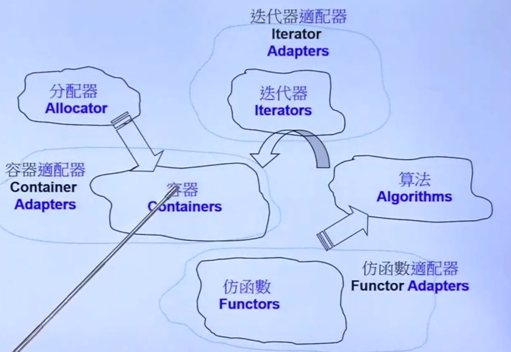
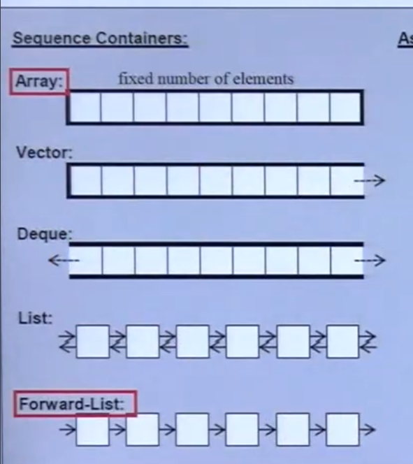
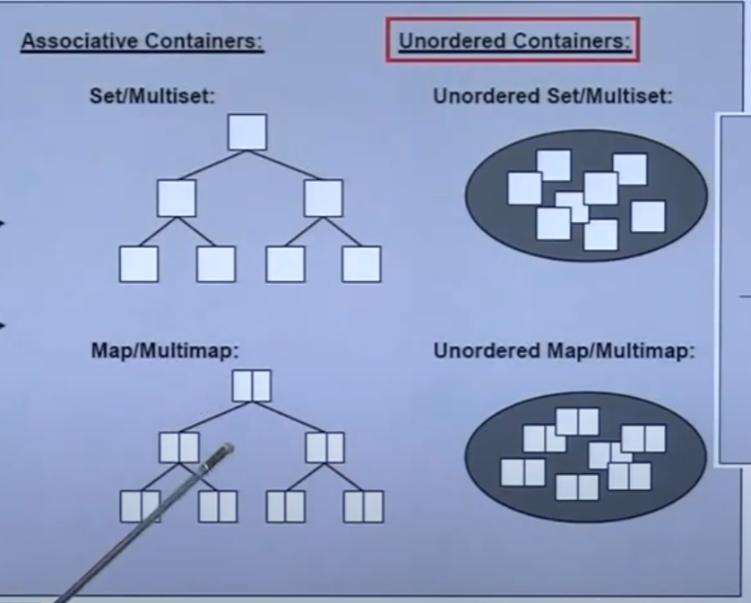

# C++ STL

## STL 头文件：

### 新式:`<cstdio>`不包含.h

### 封装：using namespace std;

## 网站：

### cplusplus.com

### CppReference.com

### gcc.gnu.org

## STL：组成





- allocator分配器，指定分配数值类型；

- count_if算法
- begin,end迭代器；
- less仿函数；
- bind2nd adapter转换器；

### Big_oh:复杂度

### iterateor:[前闭，后开)

begin()指向第一个元素；

end()指向最后一个的下一个元素；


#### 遍历：


### 新for:

```c++
for(int x:arry){
	cout<<x<<endl;
}
```

### auto关键字：

```c++
auto iter=find(c.begin(),c.end(),target)
```

从右到左推到变量类型；

## STL使用：

### 时间检查：

头文件`<ctime>`

当前时间 clock()

### 容器：

- #### Sequence：顺序

- #### Associative:关联

- Unorder:无序





- Mult非重复

Hash:


## Array:

### 定义：

- array<type,size> c;

### 函数：

- size()大小
- front()第一个
- back（）最后一个；
- data()地址值


## vector 矢量

### 定义：

- vector<Type> name；

### 特点：

- 只允许向后增长；
- **空间呈现2次方增长；**

### 测试程序：

> 使用`namespace` 分区；
>
> 分段包含头文件；
>
> 变量的声明：
>
> - 正式放在最最前；
> - 测试放在对应测试函数前 --顶格写；

### vector函数：

#### .push_back():

- 在队尾添加元素

#### .size();

- 目前容器大小；

#### .front();

- 最前元素；

#### .back();

- 最后元素；

#### .data();

- 目前地址；

#### .capacity()；

-   容器能存储数据的个数 （不分配新的内存情况下；

#### .find(.begin(),.end(),target);

- 找到特定的数据；

### 测试函数;

#### 捕获异常；

```c++
try
{
   // 保护代码
}catch( ExceptionName e )
{
  // 处理 ExceptionName 异常的代码
}
```

> 在C++中，`try-catch`块用于异常处理。它允许程序在运行时捕获和处理异常，从而避免程序崩溃。

下面是对 `try-catch` 块的解释：

##### `try` 块
`try` 块中包含可能引发异常的代码。

- 如果没有异常发生，程序会继续执行 `try` 块后面的代码。
- 如果发生异常，程序会跳到相应的 `catch` 块进行处理。

```cpp
try
{
    // 可能引发异常的代码
}
```

##### `catch` 块
`catch` 块用于捕获和处理特定类型的异常。

每个 `catch` 块都指定一种要捕获的异常类型。

如果在 `try` 块中抛出了该类型的异常，程序会跳转到相应的 `catch` 块，并执行其中的代码。

`ExceptionName` 是异常的类型，可以是标准库中的异常类型（如 `std::exception`）或用户自定义的异常类型。

```cpp
catch(ExceptionName e)
{
    // 处理 ExceptionName 异常的代码
}
```

- `std::exception` 是 C++ 标准库中所有标准异常类的基类。它定义在 `<exception>` 头文件中，提供了基本的异常接口。
- 当你捕获 `std::exception` 类型的异常时，你可以捕获任何继承自 `std::exception` 的异常类型

> `catch (const std::exception &p)` 表示捕获所有继承自 `std::exception` 的异常类型，并将捕获的异常对象引用命名为 `p`。


#### Snprintf():

> 用于将格式化的数据写入字符串中;

##### 函数原型:

```c++
int snprintf(char *str, size_t size, const char *format, ...);

```

`snprintf()` 是 C 和 C++ 中的一个函数，用于将格式化的数据写入字符串中。它属于标准输入输出库的一部分，定义在 `<cstdio>` 头文件中。与 `sprintf()` 类似，`snprintf()` 具有更好的安全性，因为它允许你指定最大输出字符数，防止缓冲区溢出。以下是对 `snprintf()` 的详细解释：


##### 参数

1. **`str`**:
   - 目标字符数组的指针，格式化后的字符串将被写入此数组。

2. **`size`**:
   - 要写入的最大字符数，包括终止符 `\0`。这意味着函数最多会写入 `size-1` 个字符，然后在末尾添加一个空字符 `\0`。

3. **`format`**:
   - 格式控制字符串，类似于 `printf()` 使用的格式字符串。它指定如何格式化后面的可变参数。

4. **`...`**:
   1. 用于给format中的 `%d %s`等赋值；
   2. 可变参数，与格式字符串中的格式说明符匹配。这些参数将根据格式字符串进行格式化并写入目标字符数组。


##### 返回值

- `snprintf()` 返回写入的字符数（不包括终止符）。如果返回值为非负且小于 `size`，表示字符串已完整写入。如果返回值大于或等于 `size`，表示输出被截断，返回值表示尝试写入的总字符数。


#### 二分查找;

```c
sort(.begin(),.end())//排序

//查找
int* p =(int*)bsearch(&target,.data(),.size(),sizeof(int),compare)
```

```c
//比较规则
int compare(const void *a, const void *b) {
    return (*(int*)a - *(int*)b);
}
```

##### 函数原型如下：

```c
c
复制代码
void *bsearch(const void *key, const void *base, size_t nmemb, size_t size, int (*compar)(const void *, const void *));
```


各个参数的解释如下：

1. `key`：指向要查找的元素的指针。
2. `base`：指向数组的指针。
3. `nmemb`：数组中元素的个数。
4. `size`：每个元素的大小（以字节为单位）。
5. `compar`：用于比较两个元素的函数指针。该函数应返回一个负值、零或正值，分别表示第一个参数小于、等于或大于第二个参数。


## list；双向链表

### 特点：

- 一个元素一个地址；


### 函数：

#### .max_size()；

- 上限；

#### .size();

- 目前容器大小；

#### .front();

- 最前元素；

#### .back();

- 最后元素；

#### .find(.begin(),.end(),target);

- 找到特定的数据；
- 顺序查找；

####  .sort();

- 非全局查找；


## forward_list;单项链表

### 特点：

- 单向；
- 头插法；


### 函数:

#### .front();

- 最前元素；

#### .max_size()；

- 上限；

#### .find(.begin(),.end(),target);

- 找到特定的数据；
- 顺序查找

####  .sort();

- 非全局排序；


## slist;

### 特点：

- 和forward_list一致；
- include<ext/slist>头；

## deque

### 特点：

- 分段buffer连续；//达到总体连续
- 每段有一个指针，放在顺序指针数组中；

### 函数:

#### .size();

- 目前容器大小；

#### .front();

- 最前元素；

#### .back();

- 最后元素；

#### .find(.begin(),.end(),target);

- 找到特定的数据；
- 顺序查找；

#### .max_size()；

- 上限；

####  .sort();

- **全局排序**；


## stack 堆（deque支持）

### 特点;

- 先进后出；

### 函数;

#### .push();

- 推入一个元素；

#### .size();

- 目前容器大小；

### .top();

- 栈顶元素；

### .pop();

- 弹出栈顶元素；


## queue 队列（deque支持）

### 特点;

- 先进先出；

### 函数：

#### .push();

- 推入一个元素；

#### .qsize();

- 目前容器大小；

### .put();

- 放入元素；

### .get();

- 取出元素；

### .empty();

- 是否为空；


## multiset （关联容器，快查找）

### 特点：

- 重复键，值 

- 红黑树；

- 构建自带排序；


### `multiset` 相关函数

#### `.insert()`

- 插入元素

```cpp
std::multiset<int> ms;
ms.insert(10);
ms.insert(20);
ms.insert(10);  // 允许重复元素
```

#### `.size()`

- 目前容器大小

```cpp
std::cout << "Size: " << ms.size() << std::endl;  // 输出容器大小
```

#### `.erase()`

- 删除元素

```cpp
ms.erase(10);  // 删除所有值为 10 的元素
auto it = ms.find(20);
if (it != ms.end()) {
    ms.erase(it);  // 删除特定位置的元素
}
```

#### `.find()`

- 查找元素
- 特定查找，自带的；

```cpp
auto it = ms.find(20);
if (it != ms.end()) {
    std::cout << "Found: " << *it << std::endl;
} else {
    std::cout << "Not found" << std::endl;
}
```

#### `.count()`

- 获取某个值的数量

```cpp
std::cout << "Count of 10: " << ms.count(10) << std::endl;
```

#### `.equal_range()`

- 查找某个值的所有实例

```cpp
auto range = ms.equal_range(10);
std::cout << "Instances of 10: ";
for (auto i = range.first; i != range.second; ++i) {
    std::cout << *i << " ";
}
std::cout << std::endl;
```

#### `.empty()`

- 检查容器是否为空

```cpp
std::cout << "Is empty: " << std::boolalpha << ms.empty() << std::endl;
```


## multimap：（对）

### 特点：

- 重复键，值 

- 红黑树；

- 构建自带排序；

### 函数：

### .find(key);

- 自带查找；

### .insert(pair<tp,tp>);

- 插入键值对；


## unordered_multiset (hash 邻接表)

### 特点;

- l邻接表；
- 一定数量重构邻接链表；


### 函数;

### .bucket_count();

- 篮子，邻接数组长度；

### .bucket_size();

- 篮子长度；

### .find();

- 自带查找；


## unordered_multimap


## Set

### 特点：

- 无重复键key；


## map

### 特点:

- key不重复;
- value可重复；
