# Pytorch

## 概论

### 学习系统：

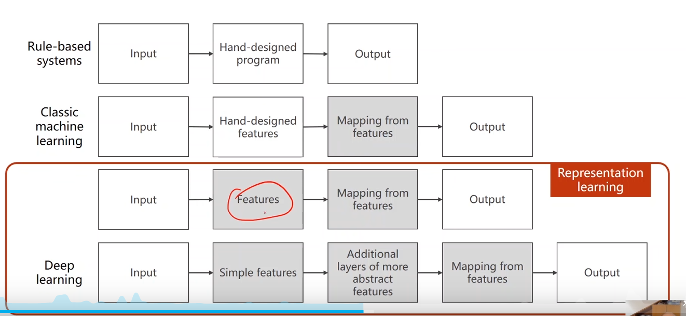

>  Deep Learning 端到端

### 神经网络：

## Lecture1:线性模型

- DataSet;//数据集合
- Model;//模型
- Training;//训练
- inferring;//推理

### 问题：

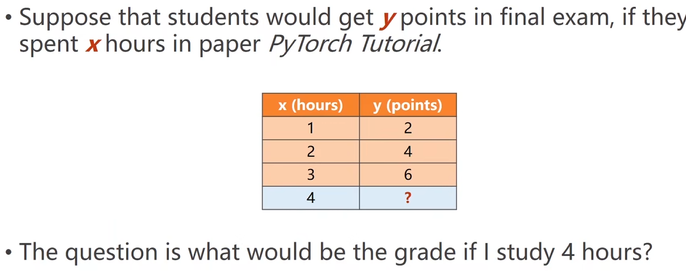

### 流程：

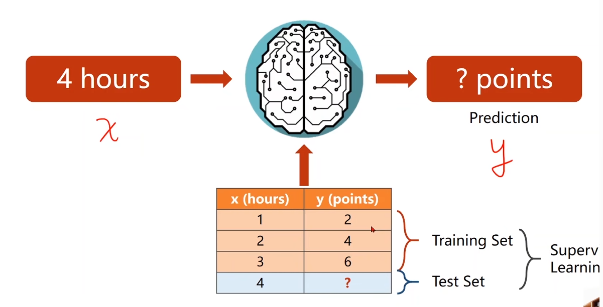

### DataSet;//数据集合：

- 训练数据集合（包含输入和输出）；使模型有更强泛化能力；
  - 开发集合：类似测试集合，用于评估模型；
- 测试数据集合（只有输入）；

### Model;//模型：

> y = f(x);

- 线性模型：Linear Model：

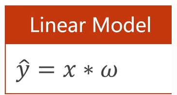

- 随机猜测（w = a random guess）；

- 求偏移程度；

​	

- 对样本评估`Evaluate`模型，求平均损失；

  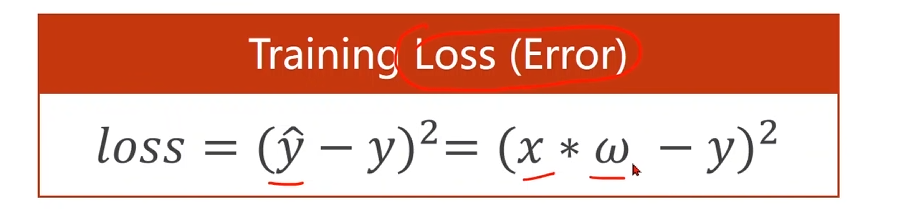

- 平均平方误差MSE;

  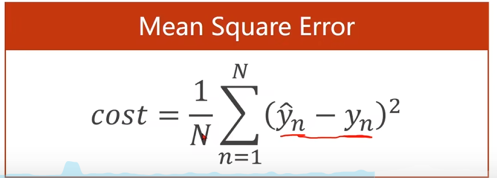

Code

Draw Graph

## 梯度下降

### 

### 梯度：

- 如果>0，函数上升；
- 如果<0，函数下降；

> 梯度负方向；

### 梯度更新：（贪心）

> a学习率要尽量取小点0.01；

**非凸函数 全局最优**

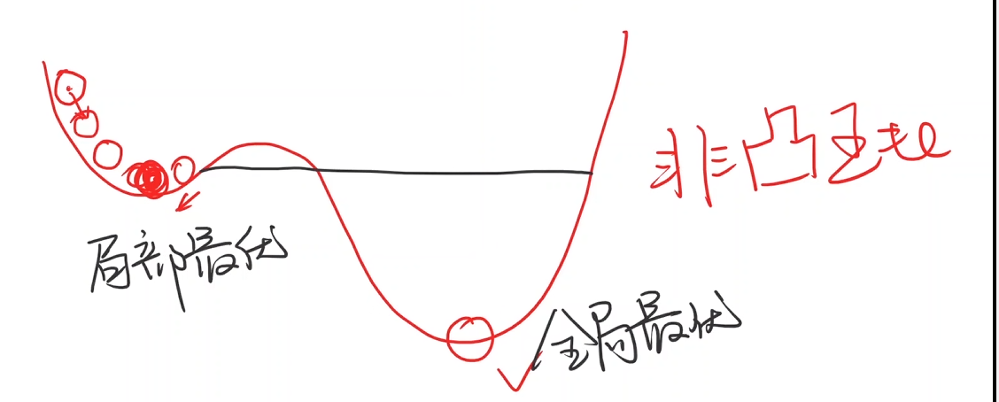

**鞍点** 

> 梯度为0;

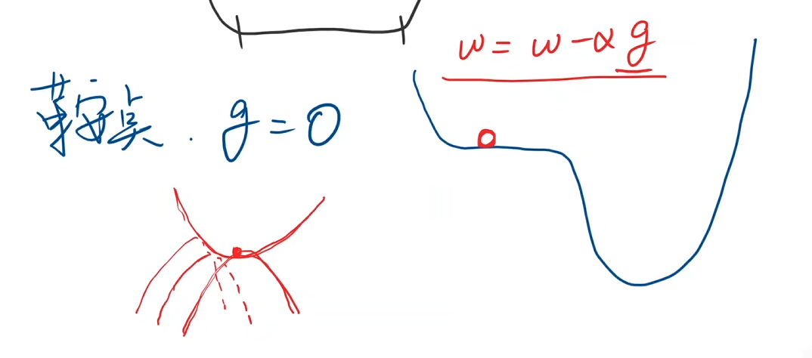

### 梯度计算：

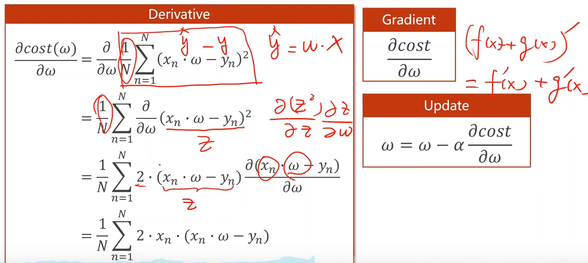

### 发散：

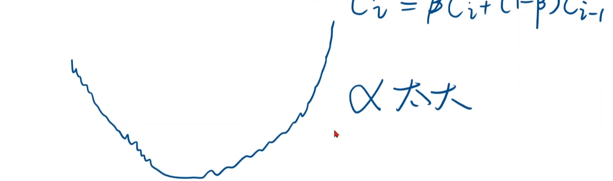

### 随机梯度下降:

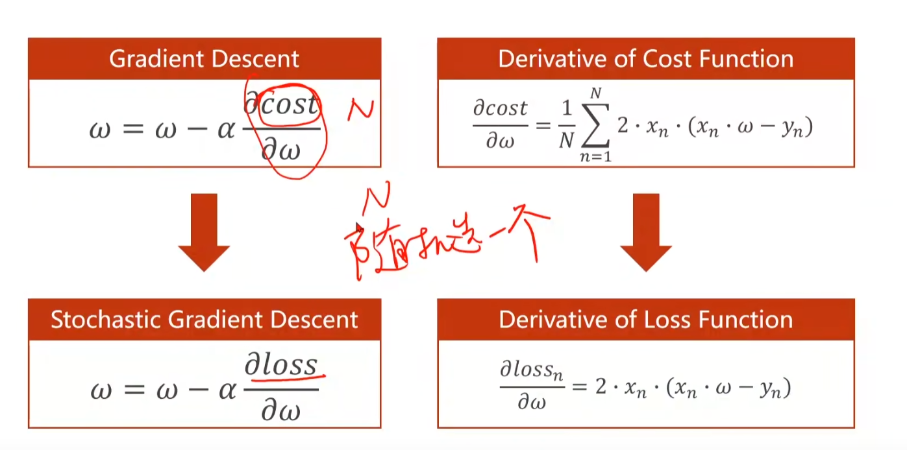

- 单个数据的损失`(pre_y - y)**2`
- 对每个样本求梯度`2*x*(w*x - y)`

### Code；

## 反向传播 

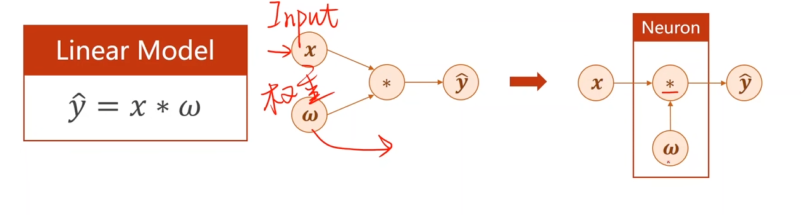

- 更新权重：

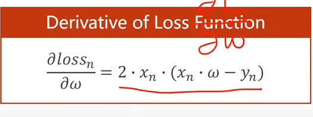

### 反向传播：

#### 层：

> X输入后x乘转置矩阵；
>
> 加上偏移量；

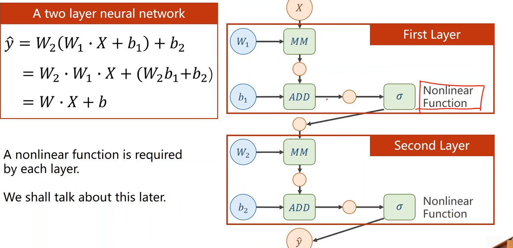

> 对每一层加非线性函数；
>
> 必须分层计算；

### 链式求导：

> 链式法则;

#### 过程：

> 先前馈后反馈；

> 为了求梯度：
> $$
> \dfrac{\partial loss}{\partial \omega}
> $$
> 转化为：
> $$
> \dfrac{\partial loss}{\partial r}
> \times
> \dfrac{\partial r}{\partial \widehat{y}}
> \times
> \dfrac{\partial \widehat{y}}{\partial \omega}
> $$
> 反向求梯度；

### Tensor:建立计算图

- Data;

- $$
  \dfrac{\partial loss}{\partial \omega}
  $$

  

#### 设定需要梯度计算：

> 默认Tensor不计算梯度；

> `x`需要转为`Tensor`；
>
> 结果也需要梯度

> .backward();求链上梯度；
>
> 取梯度的Data进行数据计算（标量）；//grad计算会生成计算图；
>
> .item()取值计算；
>
> .grad.data.zero()清零运算；//每次都要

### 总结：

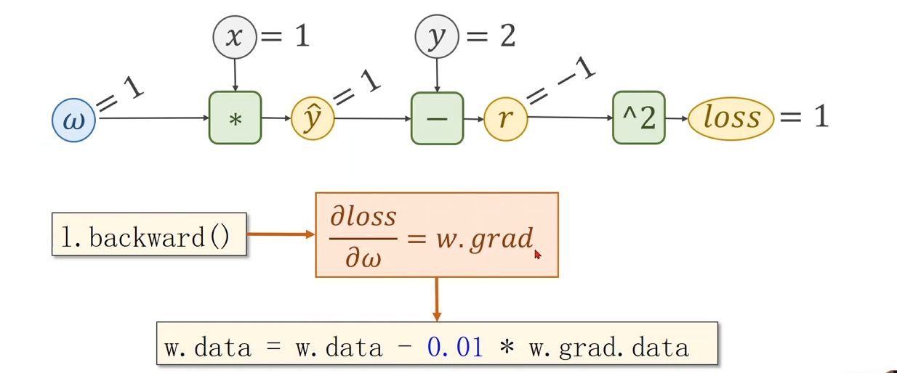
