# Pytorch

## 概论

### 学习系统：


>  Deep Learning 端到端


### 神经网络：


## Lecture1:线性模型

- DataSet;//数据集合
- Model;//模型
- Training;//训练
- inferring;//推理

### 问题：


### 流程：

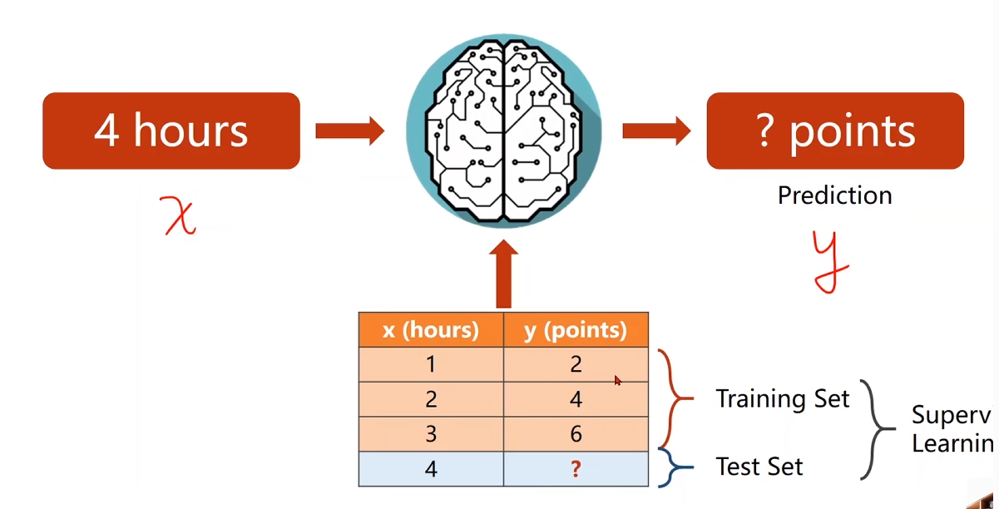

### DataSet;//数据集合：

- 训练数据集合（包含输入和输出）；使模型有更强泛化能力；
  - 开发集合：类似测试集合，用于评估模型；
- 测试数据集合（只有输入）；


### Model;//模型：

> y = f(x);

- 线性模型：Linear Model：

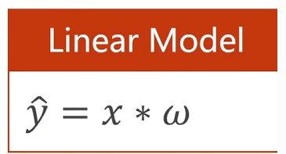

- 随机猜测（w = a random guess）；

- 求偏移程度；

​	

- 对样本评估`Evaluate`模型，求平均损失；

  

- 平均平方误差MSE;

  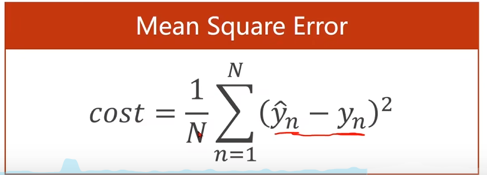


Code


Draw Graph

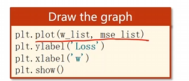


## 梯度下降

### 

### 梯度：

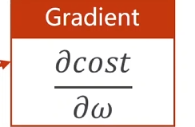

- 如果>0，函数上升；
- 如果<0，函数下降；

> 梯度负方向；


### 梯度更新：（贪心）


> a学习率要尽量取小点0.01；


**非凸函数 全局最优**

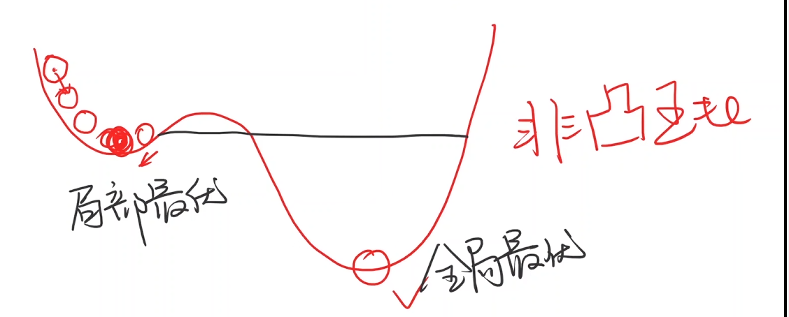


**鞍点** 

> 梯度为0;

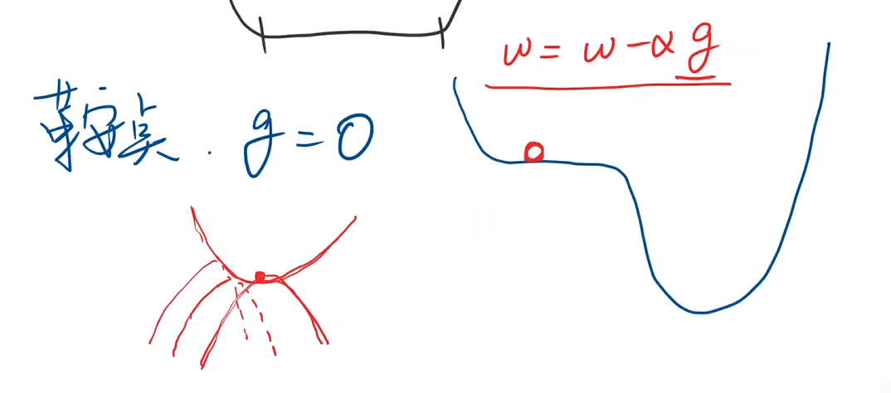


### 梯度计算：


### 发散：


### 随机梯度下降:


- 单个数据的损失`(pre_y - y)**2`
- 对每个样本求梯度`2*x*(w*x - y)`

### Code；


## 反向传播 


- 更新权重：


### 反向传播：

#### 层：


> X输入后x乘转置矩阵；
>
> 加上偏移量；


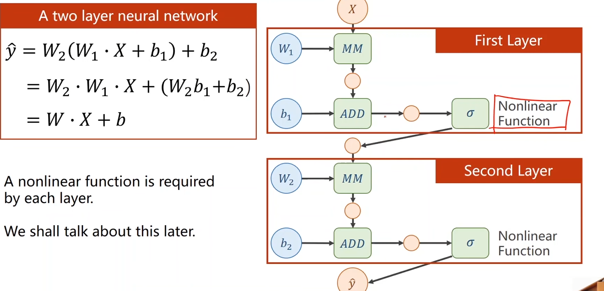

> 对每一层加非线性函数；
>
> 必须分层计算；


### 链式求导：

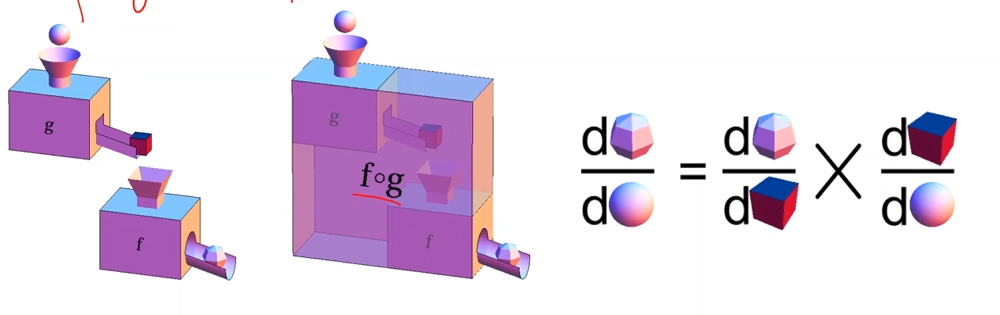

> 链式法则;

#### 过程：


> 先前馈后反馈；


> 为了求梯度：
> $$
> \dfrac{\partial loss}{\partial \omega}
> $$
> 转化为：
> $$
> \dfrac{\partial loss}{\partial r}
> \times
> \dfrac{\partial r}{\partial \widehat{y}}
> \times
> \dfrac{\partial \widehat{y}}{\partial \omega}
> $$
> 反向求梯度；


### Tensor:建立计算图

- Data;

- $$
  \dfrac{\partial loss}{\partial \omega}
  $$

  

#### 设定需要梯度计算：


> 默认Tensor不计算梯度；


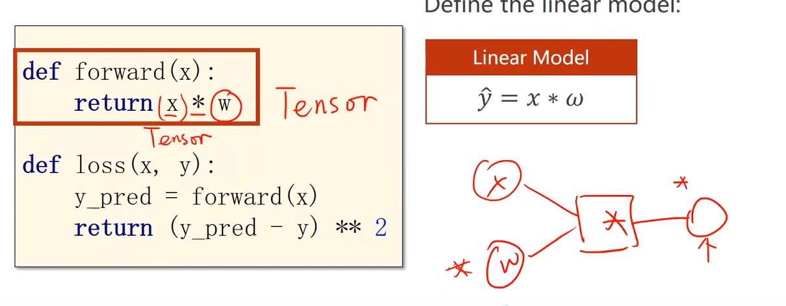

> `x`需要转为`Tensor`；
>
> 结果也需要梯度


> .backward();求链上梯度；
>
> 取梯度的Data进行数据计算（标量）；//grad计算会生成计算图；
>
> .item()取值计算；
>
> .grad.data.zero()清零运算；//每次都要


### 总结：


## PyTorch线性回归

> Pytorch工具使用；


### PyTorch:

#### 广播：

> 非矩阵数据和矩阵数据计算，自动广播为对应大小矩阵；


> 


### 数据集合：

> mini-batch;

```python
x_data = torch.Tensor([[1.0], [2.0], [3.0]])
y_data = torch.Tensor([[2.0], [4.0], [6.0]])
```

> 符合构造计算图的输入；Linear期待二维张量的输入

### 设计模型：

> 构造计算图；

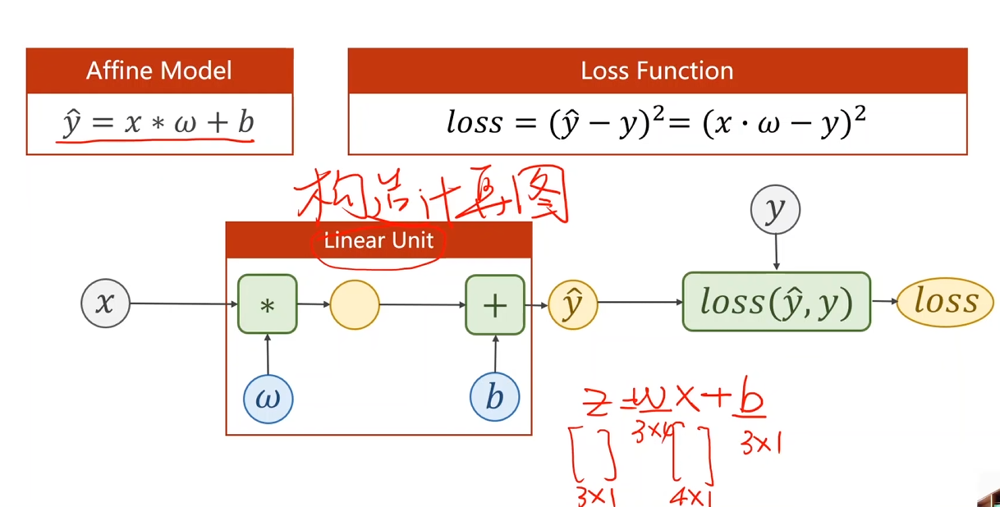

> 由输出y 输入x 确定w b矩阵类型；
>
> loss 为标量；


#### model类：

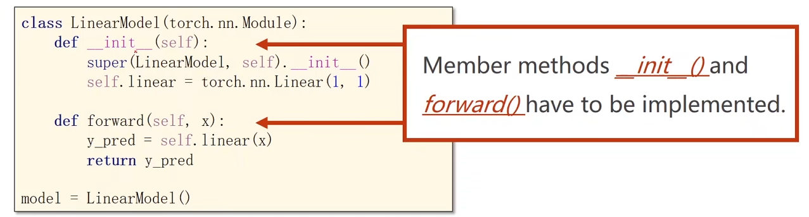

> 继承Module(构建计算图) `super`继承父类；
>
> Linear 包含 权重w  b ；
>
> `forward()`为前馈函数 `Moduls`本身包含需要重构；


#### Linear:

 PyTorch的nn.Linear（）是用于设置网络中的全连接层的，需要注意在二维图像处理的任务中，全连接层的输入与输出一般都设置为二维张量，形状通常为[batch_size, size]，不同于卷积层要求输入输出是四维张量。其用法与形参说明如下：

-   in_features指的是输入的二维张量的大小，即输入的[batch_size, size]中的size，**每个样本的大小**。

-   out_features指的是输出的二维张量的大小，即输出的二维张量的形状为[batch_size，output_size]，当然，它也代表了该全连接层的神经元个数。

  从输入输出的张量的shape角度来理解，相当于一个输入为[batch_size, in_features]的张量变换成了[batch_size, out_features]的输出张量。


> 默认`bias`为`True`

#### Override : forward()


### 损失函数 


> nn.MSELoss(继承自Moduls)；

#### MSELoss:

- `size_avarege` 是否求均值；
- `reduce` 是否降维度；


### 优化器：


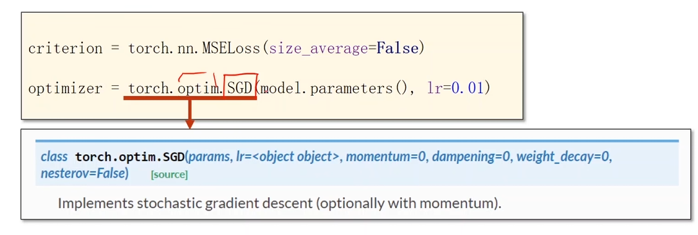

#### `optim.SGD`

- `params` 确定`Moduls`成员中需要梯度更新的成员；
- `lr` 学习率


`reduction='sum'` 是 PyTorch 损失函数中的一个参数，用于指定如何对批次中的损失进行聚合。PyTorch 的损失函数（例如 `nn.MSELoss`）支持三种类型的聚合方式：`'none'`、`'mean'` 和 `'sum'`。

- `'none'`：不进行任何聚合，直接返回每个样本的损失。
- `'mean'`：对所有样本的损失求平均值。
- `'sum'`：对所有样本的损失求和。

### 训练周期：

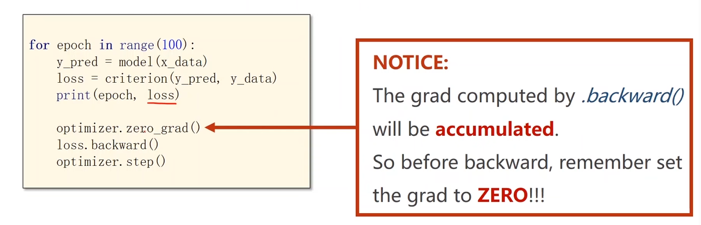

> `print`中`loss` 为标量；
>
> 梯度清0；
>
> `Backward`反向传播；


#### 打印:

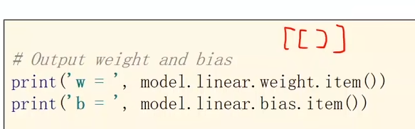

#### 测试：

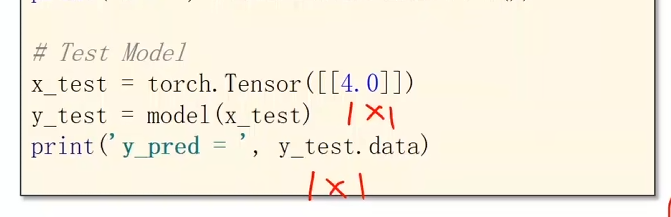


## Logistic Regression分类

> 输出概率值；


### 官方数据集合：

#### MNIST:

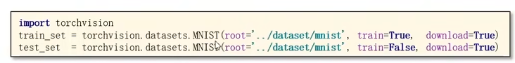

> `train`是否为训练集；
>
> `download`第一次是否从网络下载；


#### CIFAR-10：


### 二分类：

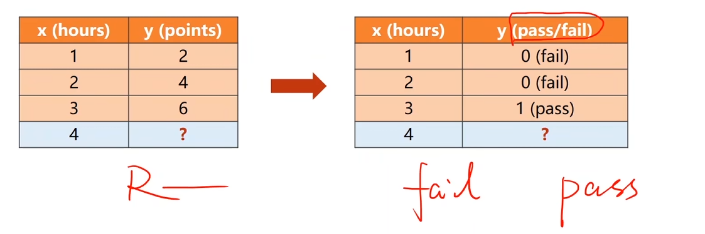

> 计算通过概率；
>
> `pass` or`fail`
> $$
> p(\widehat{y}=1)+p(\widehat{y}=0)=1
> $$

> 近似0.5处于不确定；

#### 实数映射概率：

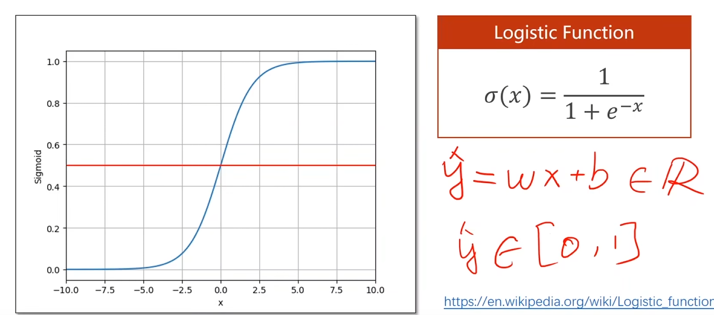

> 将预测的实数值映射[0,1]的概率；

> 将Logistic函数中变量x换为为 ：
> $$
> \widehat{y} = w*x+b
> $$


#### sigmoid函数

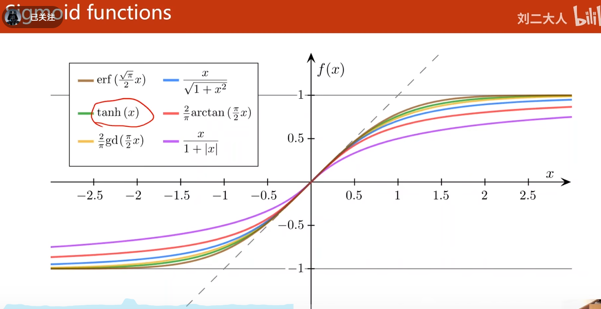

### 回归模型：

> Logistic函数；

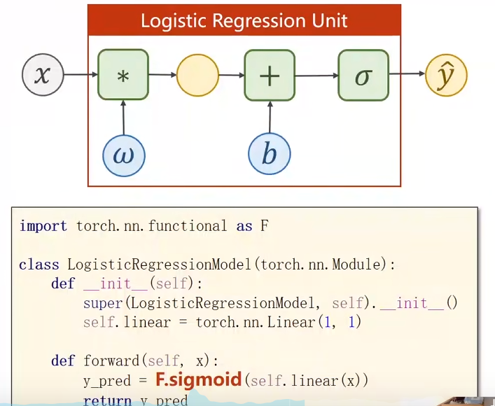

> 函数包：`torch.nn.functional`


### BCE Loss损失函数：

#### 函数：

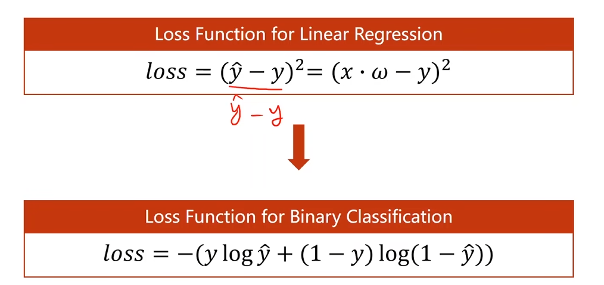

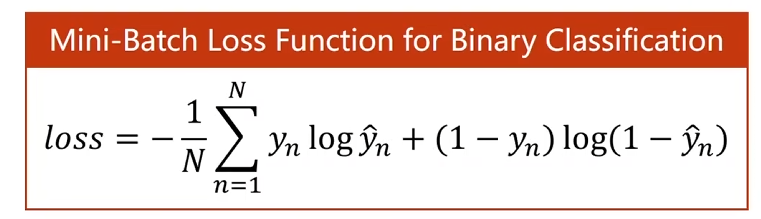

> 分布的差异;越接近y，loss越小；

> $$
> y=1时\quad loss=-ylog\widehat{y}
> $$

> $$
> y=0时\quad loss=-ylog(1-\widehat{y})
> $$


#### 代码：

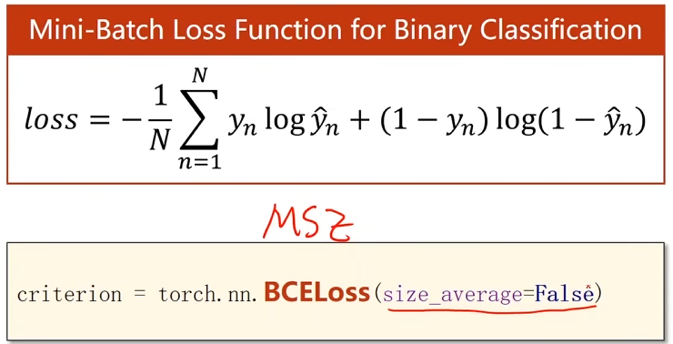

> `sive_average` 影响后期学习率；


### Code：


### 绘图：

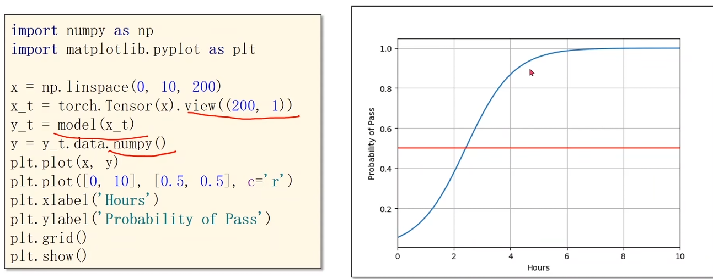

> `x = np.linspace(0, 10, 200)`创建一个从0到10的200个等间隔的点；

> `x_t = torch.Tensor(x).view((200, 1))`将 numpy 数组转换为 PyTorch 张量，并调整其形状为 (200, 1)；

> `y = y_t.data.numpy()`将 PyTorch 张量 y_t 转换为 numpy 数组 y；

> `plt.plot([0, 10], [0.5, 0.5], c='r')`绘制一条红色的线，表示在 x 从 0 到 10 范围内，y 的值为 0.5 的水平线;

> `plt.grid()`显示网格；

